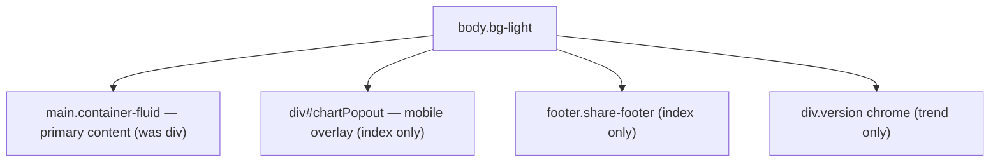

# Add `<main>` landmark to dashboard pages

## Summary

The dashboard pages `docs/index.html` and `docs/trend.html` wrapped their
primary content region only in generic `
`s, leaving assistive-technology
users with no "skip to main content" target and no programmatic main-content
boundary. The HTML best-practices bucket requires exactly one `<main>` landmark
per page.

Fixed by promoting each page's top-level `container-fluid` wrapper from a
generic `
` to `<main class="container-fluid">` (with the matching close
tag). The Bootstrap class — and therefore all styling — is unchanged, so this
is a purely semantic swap with no visual difference. The page `<footer>`, the
mobile chart pop-out overlay and the version chrome remain siblings of `<main>`,
so each page has exactly **one** main landmark. Closes #693.

## Evidence

This is a semantic HTML change with no visual impact — the `container-fluid`
class and all styling are preserved, so the rendered pages look identical.
Playwright MCP was unavailable in this run, so no screenshot was captured;
instead the change was verified by:

- Serving `docs/` locally and confirming both pages emit
  `<main class="container-fluid">` in the rendered HTML.
- New automated assertions in `tests/main_landmark_test.ts` reading the real
  committed HTML.

## Test Plan

Added `tests/main_landmark_test.ts`, which verifies against the real committed
HTML:

- `docs/index.html` / `docs/trend.html`: each has exactly one `<main>` open and
  one `</main>` close tag.
- Each page exposes the primary content region as `<main class="container-fluid">`.
- The `<main>` opens inside `<body>` before it closes.
- `index.html`: the page `<footer>` sits outside (after) the `<main>` landmark.

All 7 new tests pass, and the full Deno suite (`deno test --allow-read tests/*.ts`)
passes with 1283 tests green.
