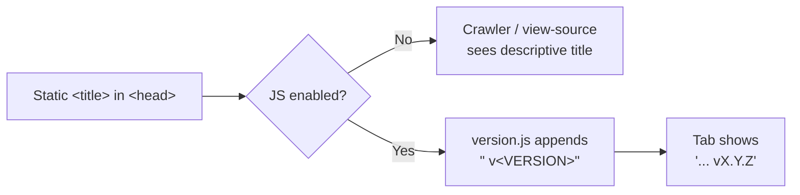

# PR Summary — Static `<title>` on dashboard pages (Issue #694)

## Summary

`docs/index.html` and `docs/trend.html` carried no static `<title>` element —
the document title was injected solely at runtime by `version.js`. Any consumer
that read the page before script execution (some crawlers, view-source, no-JS
contexts) therefore saw no title, failing the HTML best-practices requirement
for a present, descriptive `<title>`.

This PR adds a descriptive static `<title>` to each `<head>`
(`GRQ Validation Dashboard` and `GRQ Validation Trend`) and changes
`version.js` to **augment** that static title — appending the version — rather
than being the sole source. When no static title is present it still falls back
to the `app-title` meta, and it never emits a dangling `" v"` suffix when the
version is unknown. The rendered, JS-enabled title is unchanged
(e.g. `GRQ Validation Dashboard v1.1.47`).

Closes #694.

## Evidence

Static titles are now present before any script runs. Served locally via a
static file server and fetched with `curl` (no JS execution):

```text
$ curl -s http://localhost:8080/index.html | grep -o '<title>[^<]*</title>'
<title>GRQ Validation Dashboard</title>
$ curl -s http://localhost:8080/trend.html | grep -o '<title>[^<]*</title>'
<title>GRQ Validation Trend</title>
```

Title bootstrap flow:



Playwright MCP browser tooling was unavailable in this run, so runtime
behaviour was verified programmatically instead: `tests/static_title_test.ts`
executes `docs/version.js` against a minimal document stub and asserts the
augmented `document.title`.

## Test Plan

Added `tests/static_title_test.ts`:

- `docs/index.html` / `docs/trend.html` each contain a static, descriptive
  `<title>` inside `<head>`.
- `version.js` augments a static `<title>` with the version
  (`GRQ Validation Dashboard` → `GRQ Validation Dashboard v1.2.3`).
- `version.js` does not blank a static title nor append an empty `" v"` when no
  `app-version` meta is present.
- `version.js` falls back to the `app-title` meta when the document has no
  static title.

All tests pass and `./quality.sh` completes cleanly.
