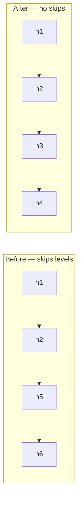

# Fix heading hierarchy skip in docs/index.html (h2 → h5 → h6)

## Summary

`docs/index.html` had a broken heading outline: `<h1>` → `<h2>` → `<h5>` → `<h6>`,
skipping `<h3>` and `<h4>`. The `<h5>`/`<h6>` tags were Bootstrap card titles
chosen for visual size rather than document structure, so screen-reader users
navigating by heading level hit a broken outline.

Fixed by using the correct semantic heading level and controlling visual size
with Bootstrap's `.h5`/`.h6` utility classes instead of the heading tags:

- "Market Performance Comparison" card title: `<h5 class="card-title mb-0">` →
  `<h3 class="card-title h5 mb-0">`
- The three index-card titles (SP500 / NASDAQ / Russell 2000):
  `<h6 ... class="mb-2">` → `<h4 ... class="h6 mb-2">`

The outline is now `1,2,3,4,4,4` — descends without skipping levels. Element
`id`s are unchanged, so the app.js hooks that populate the titles still work,
and the centring CSS targets the `.card-title` *class* (not the `h5` tag), so
the visual rendering is identical.

Closes #695.

## Evidence

The change is semantic-only; the `.h5`/`.h6` utility classes preserve the exact
visual size. The screenshot below shows the "Market Performance Comparison" card
(now `<h3>`) and its three index titles (now `<h4>`) rendering unchanged:

## Test Plan

- Added `tests/heading_hierarchy_test.ts` — reads the real committed HTML and
  asserts the heading outline never skips a level and starts at a single `<h1>`,
  for both `docs/index.html` and `docs/trend.html`. Fails against the unfixed
  markup (`h2 → h5` jump), passes after the fix.
- Updated `tests/section_title_centring_test.ts` — it previously pinned the
  `<h5>` tag; its stated contract is the `.card-title` class hook (what the
  centring CSS targets), so it now matches any heading level bearing
  `.card-title`. This is a documented consequence of changing the tag from
  `<h5>` to `<h3>`; the behaviour it guards is unchanged.
- Full Deno suite: `deno test --allow-read tests/*.ts` → 1292 passed, 0 failed.
