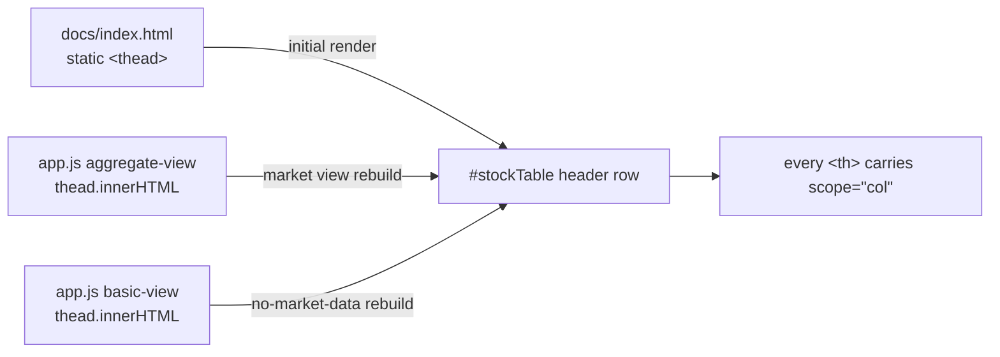

# Data table `#stockTable` headers now declare `scope="col"`

## Summary

`#stockTable` is a genuine data table (score / price / target columns) but its
column-header `<th>` cells carried no `scope`, weakening cell-to-header
association for screen readers. This PR adds `scope="col"` to every
column-header `<th>`.

The header row lives in **three** places that must stay consistent, so all
three were fixed — otherwise the runtime rebuild would silently drop the
attribute the static markup added:

1. `docs/index.html` — the static `#stockTable <thead>` (initial render).
2. `docs/app.js` — the **aggregate market view** `thead.innerHTML` rebuild.
3. `docs/app.js` — the **basic (no-market-data) view** `thead.innerHTML` rebuild.

The `#stockTableBody` rows contain only `<td>` data cells — there are no `<th>`
row-header cells — so the finding's optional `scope="row"` suggestion has no
applicable cells and no `<td>`→`<th>` conversion was made (that would have
changed the first-column visual styling via the `.stock-table th` rule).

Closes #696.

## Evidence

Purely additive semantic-accessibility attribute — `scope="col"` produces **no
visual change**, so a screenshot is not meaningful here. Evidence is behavioural:

- New Deno tests (below) parse the real committed markup and assert every
  `<th>` in each of the three header templates carries `scope="col"`.
- Served-page check confirmed the attribute reaches the browser: `docs/app.js`
  serves 17 `scope="col"` occurrences and `docs/index.html`'s `#stockTable`
  `<thead>` renders each header with `scope="col"`.
- Full suite: `deno test --allow-read tests/*.ts` → **1296 passed, 0 failed**.

## Test Plan

Added `tests/stock_table_header_scope_test.ts`:

- `index.html: static #stockTable headers all carry scope=col` — parses the
  static `<thead>` and asserts every `<th>` has `scope="col"`.
- `app.js: aggregate-view header rebuild carries scope=col` — extracts the
  market-view `thead.innerHTML` template and asserts the same.
- `app.js: basic-view header rebuild carries scope=col` — extracts the
  basic-view template and asserts the same.
- `thCells: counts and isolates top-level <th> cells` — unit test for the
  cell-splitting helper.

These fail against the pre-fix markup (all three header locations lacked
`scope`) and pass after the change.
