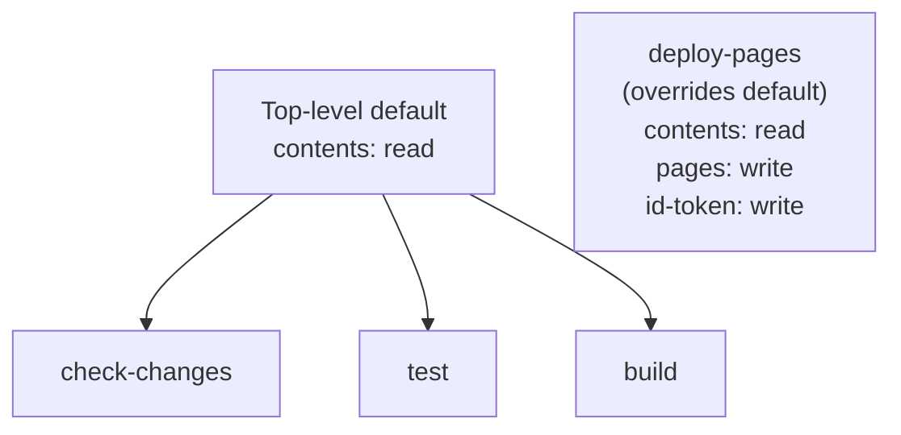

# Declare an explicit permissions block in ci.yml (Issue #70)

## Summary

`.github/workflows/ci.yml` previously declared no top-level `permissions:`
block, so the `check-changes`, `test`, and `build` jobs inherited the
repository-default `GITHUB_TOKEN` scope rather than an explicit least-privilege
grant. This needlessly widened the blast radius if any step — or a dependency
it installs (`cargo-tarpaulin`, `cargo-cyclonedx`) — were compromised.

This change adds a restrictive top-level default of `contents: read`, which the
three build/test jobs inherit (they only ever read repository contents). The
`deploy-pages` job keeps its elevated per-job grant; because a per-job
`permissions:` block fully overrides the top-level default, `contents: read` is
restated there alongside `pages: write` / `id-token: write` so its checkout step
still works.

Closes #70.

## Evidence

This is a CI workflow / configuration change with no web interface to
screenshot. It is verified by the Deno test suite in
`tests/ci_workflow_test.ts`, which parses `ci.yml` as YAML and asserts on the
resulting permissions structure (real behaviour, not source-text grepping).

Permission scoping after the change:

`./quality.sh < /dev/null` passed cleanly (EXIT=0): all Rust checks plus
166 Deno tests passed, with `deno fmt`, `deno lint`, and `deno check` clean.

## Test Plan

Added to `tests/ci_workflow_test.ts` (all failing before the fix, passing
after):

- `CI workflow declares a restrictive top-level permissions default` — asserts
  the top-level `permissions.contents` is `read`.
- `CI workflow grants no write scopes at the top level` — asserts no top-level
  scope is `write`.
- `deploy-pages keeps its elevated per-job permissions` — asserts the
  `deploy-pages` job retains `pages: write`, `id-token: write`, and restates
  `contents: read`.
- `build/test jobs do not declare their own permissions (inherit top-level)` —
  asserts `check-changes`, `test`, and `build` declare no per-job block and so
  inherit the least-privilege default.
