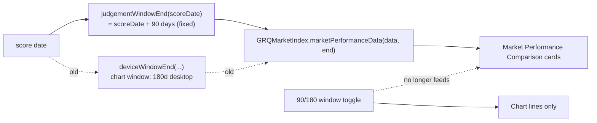

## Summary

The **Market Performance Comparison** cards were judged over the *plotted chart
window* (desktop default **180 days**, per #465/#466), while the portfolio is
judged at the fixed **90-day** mark. For a 5 Jan 2026 score date the cards
therefore reported each index's gain to the latest close (~178 days) — SP500
**+8.4%** / NASDAQ **+11.3%** / Russell 2000 **+18.2%** — even though at the
90-day mark all three indices were *below* the baseline. That is the exact
"double-digit gains while the chart shows them below zero" mismatch in the issue.

The fix judges the cards over the **same 90-day window as the portfolio**,
independent of the chart's display window. `getMarketPerformanceData()` now
passes a fixed 90-day window end (`GRQProjection.judgementWindowEnd(scoreDate)`)
into the existing window-aware kernel instead of the per-device chart window end
(`deviceWindowEnd`). A score date younger than 90 days still falls back to the
latest available close (a running figure, like the portfolio's Actual) until the
window matures. The cards gain an **"as at `<date>`"** caption of the exact
90-day close date, so once pinned to 90 days they no longer match a 180-day
chart's right edge without that reading as a new bug. Applies to both the
aggregate and single-stock views (shared code path).

The **Trend view is already correct** (`trend_predictions.js`
`PREDICTION_WINDOW_DAYS = 90` and `index_overlay.js` `OVERLAY_WINDOW_DAYS = 90`
are both 90-day on portfolio and index sides) — no change needed there.

Closes #705.

## Change flow



## Evidence

Desktop, 5 Jan 2026 score, **180-day** chart window still selected — the cards
now report the true 90-day figures (SP500 −4.6% / NASDAQ −6.5% / Russell 2000
−0.7%, matching the index lines at the red 90-day mark), captioned "Judged at
the 90-day mark, as at 2 Apr 2026". The portfolio (Actual 13.7% at day 90) beat
all three:


Reproduced numerically against the committed `docs/market-indices.json`:

```
BEFORE fix — desktop chart window (180d, run-to-latest)
  SP500           +8.4%   (6902.05 -> 7483.23)   as at 1 Jul 2026
  NASDAQ         +11.3%   (23395.82 -> 26040.03)
  Russell 2000   +18.2%   (2547.92 -> 3012.59)

AFTER fix  — fixed 90-day judgement window
  SP500           -4.6%   (6902.05 -> 6582.69)    as at 2 Apr 2026
  NASDAQ          -6.5%   (23395.82 -> 21879.18)
  Russell 2000    -0.7%   (2547.92 -> 2530.04)
```

## Test Plan

New TDD regression suite `tests/market_comparison_90day_window_test.ts` (8 tests),
pinned to the exact historical values the issue nominated so the error can never
silently reoccur:

- `judgementWindowEnd` — end is exactly scoreDate + 90 days at local midnight;
  independent of the chart/device window (always the mobile-90 end, always
  shorter than the desktop-180 end); null on missing/unparseable score date.
- `asOfDate` — resolves the last close date on or before the window end;
  tolerant of empty/missing inputs.
- Young-score fallback — a score date < 90 days old uses the latest available
  close (running figure).
- `issue #705 - the committed data file holds the nominated historical closes` —
  asserts `docs/market-indices.json` still contains the 5 Jan 2026 baselines and
  2 Apr 2026 (90-day) closes.
- `issue #705 - cards judged at 90 days report the real -4.6% / -6.5% / -0.7%` —
  end-to-end through the real kernel; also asserts the OLD 180-day window is the
  buggy double-digit-gain case.

Note: the existing `tests/chart_summary_window_test.ts` and
`tests/market_index_test.ts` continue to pass unchanged — they exercise the pure
helpers (`deviceWindowEnd`, `marketPerformanceData`, `priceAsOf`) whose
window-aware behaviour is unchanged; only the *wiring* in
`getMarketPerformanceData()` moved from the chart window to the fixed 90-day
window, which those helper tests do not constrain.

Full gate green: `deno test` (1304 passed), `deno fmt --check`, `deno lint`,
`deno check`, and `cargo check --all-targets` (Rust untouched).

## Security self-check

Frontend-only change; no new input surface, no injection sink, no secrets. The
"as at" caption is built from an internal `Date` via the existing deterministic
`GRQFreshness.formatAnalysisDate` and written with `textContent` (no innerHTML).
