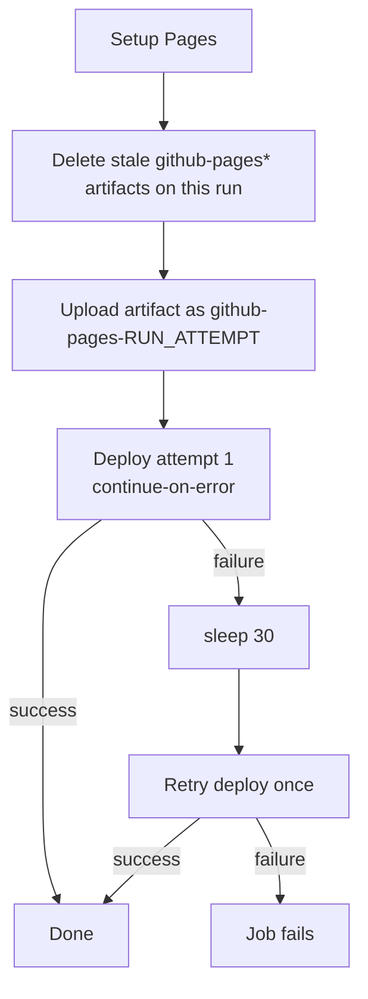

# Pages deploy re-runs no longer fail on duplicate github-pages artifacts

## Summary

Re-running a failed CI/CD run deterministically failed because
`upload-pages-artifact` added a second `github-pages` artifact onto the same
run and `deploy-pages` hard-fails when it finds more than one (`Multiple
artifacts named github-pages … Artifact count is 2`). Attempt 1 of the
triggering run had also failed on a GitHub-side transient, so an unattended
daily deploy had no way to self-recover.

This hardens the `deploy-pages` job in `.github/workflows/ci.yml` (belt and
braces):

- **Per-attempt artifact name** — upload as
  `github-pages-${{ github.run_attempt }}` and point
  `deploy-pages` at the same `artifact_name`, so a re-run never collides with an
  earlier attempt's artifact.
- **Stale-artifact cleanup** — before upload, delete any leftover
  `github-pages*` artifacts on the current run via the Actions API. The job now
  also grants `actions: write` for this.
- **One automatic retry** — the first deploy uses `continue-on-error`, a 30 s
  wait follows, then a single retry step runs only when the first attempt
  failed. Transient GitHub-side failures self-recover; a second failure fails
  the job as normal.

The check/test/build jobs are unchanged, and `deploy-pages` stays main-only.

Closes #706.

## Evidence

Backend/workflow-only change — no web UI to screenshot. Verified via the new
Deno tests that parse the workflow as structured data (not source-text greps)
plus the existing CI workflow suite; all pass.



Test run:

```
deno test --allow-read tests/pages_deploy_rerun_test.ts tests/ci_workflow_test.ts
ok | 19 passed | 0 failed
```

Full suite: `deno test --allow-read tests/*.ts` → `1310 passed | 0 failed`.

## Test Plan

Added `tests/pages_deploy_rerun_test.ts`, which reproduces the failure mode and
verifies the fix:

- `deploy-pages job grants actions: write for artifact cleanup`
- `deploy-pages preserves its existing elevated permissions`
- `upload-pages-artifact uses a per-attempt artifact name`
- `deploy-pages targets the same per-attempt artifact name`
- `deploy-pages deletes stale github-pages artifacts before upload`
- `deploy step is retried once after a wait on transient failure`

Existing `tests/ci_workflow_test.ts` continues to pass unchanged, confirming no
regression to SHA pinning, permissions scoping, concurrency, triggers, or the
main-only Pages guard.

## Note

Re-running the original failed run (28620059487) replays the old workflow
snapshot and will still fail; the live site catches up on the next fresh push
to `main`. The fix applies to future runs.
