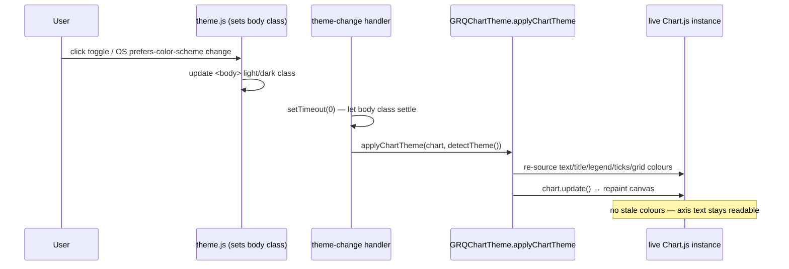

# Re-theme live charts on theme switch (Issue #708)

## Summary

The dashboard charts kept the **previous** theme's colours after the theme
changed, leaving the canvas-drawn axis ticks, axis titles and desktop legend
unreadable — near-white text on a white page after switching to light, and
dark text on a dark page after switching to dark.

**Root cause:** Chart.js paints axis ticks, axis titles, the legend and grid
lines **once** at chart build from `GRQChartTheme.chartTheme(detectTheme())`
(`docs/app.js`, `docs/trend.js`). The existing theme-change handlers
(`docs/app.js`, the toggle click + `prefers-color-scheme` listener) only
re-derived the DOM market-card **title** colours — the code comment there even
noted "the chart is not rebuilt on a theme switch". DOM-based accessibility
gates (pa11y) structurally cannot inspect canvas pixels, so nothing caught it.

**Fix:** add `GRQChartTheme.applyChartTheme(chart, theme)` — the single source
of truth that re-sources **every** canvas colour (default text, canvas title,
legend labels, per-axis titles/ticks, grid lines) from the theme and repaints
the live chart via `chart.update()`. It is wired into both theme-change signals
(the header theme-toggle click and the OS `prefers-color-scheme` change), in
**both** switch directions, for:

- the main dashboard chart (`docs/app.js`) — which the mobile chart pop-out
  **re-parents** rather than rebuilding, so re-theming the one live instance
  covers the pop-out too;
- the trend chart (`docs/trend.js`, new `wireThemeChange()`).

`chart_theme.js` is now also loaded on `trend.html`, and `APP_VERSION` is bumped
`1.1.50 → 1.1.51` (via `scripts/bump_version.ts`) so the service worker cache
key changes and stale clients refetch the fix.

Fixes #708.

## Evidence

Playwright MCP browser tools were not available in this run, so a live
screenshot could not be captured. The fix is verified by a behavioural
regression test that exercises the real shipped helper
(`GRQChartTheme.applyChartTheme`) rather than the implementation text: it builds
a chart coloured for one theme, switches it to the other, and asserts **no**
stale colours remain and the chart repainted. It fails on the pre-fix code
(the helper does not exist) and passes with the fix.

```
deno test --allow-read tests/chart_theme_reapply_test.ts
running 5 tests from ./tests/chart_theme_reapply_test.ts
applyChartTheme is published on GRQChartTheme ... ok
light chart switched to dark keeps NO stale light colours ... ok
dark chart switched to light keeps NO stale dark colours ... ok
an unknown theme falls back to the readable light palette ... ok
applyChartTheme is a safe no-op for a missing/half-built chart ... ok
ok | 5 passed | 0 failed
```

Full suite: `deno test --allow-read tests/*.ts` → **1315 passed, 0 failed**.

### Theme-switch flow (after the fix)



## Test Plan

- **Added** `tests/chart_theme_reapply_test.ts` — behavioural regression for
  #708:
  - `applyChartTheme` is published on `GRQChartTheme`.
  - light→dark switch leaves no stale light colours (text + grid) and repaints.
  - dark→light switch leaves no stale dark colours (text + grid) and repaints.
  - an unknown theme falls back to the readable light palette.
  - a missing/half-built chart is a safe no-op (no throw).
- **Existing** `tests/chart_theme_contrast_test.ts`,
  `tests/sw_precache_list_test.ts`, `tests/trend_view_wiring_test.ts` all still
  pass (version alignment + trend asset wiring).
- Full Deno suite: 1315 passed, 0 failed. `deno fmt`, `deno lint`, `deno check`
  clean.
