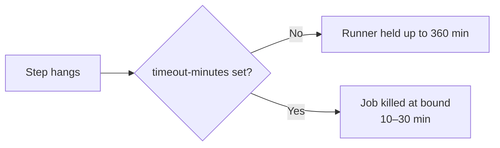

# Set `timeout-minutes` on every workflow job

## Summary

No job in any repository workflow declared `timeout-minutes:`, so each fell
back to GitHub's 360-minute (6-hour) default. A wedged step — a flaky network
install, a stuck `deno test`, or a runaway build — could hold a runner for up
to six hours, blocking the queue and burning minutes.

This change adds an explicit, work-sized `timeout-minutes:` to all 12 jobs
across the 9 workflows, bounding each job's worst case. Heavier Rust
build/test jobs get 30 minutes; lint/audit/security jobs get 10–15. Closes #71.

| Workflow | Job | timeout-minutes |
| --- | --- | --- |
| `ci.yml` | `check-changes` | 10 |
| `ci.yml` | `test` | 30 |
| `ci.yml` | `build` | 30 |
| `ci.yml` | `deploy-pages` | 15 |
| `deno-quality.yml` | `quality` | 15 |
| `cargo-audit.yml` | `audit` | 15 |
| `deno-outdated.yml` | `outdated` | 15 |
| `dependency-review.yml` | `dependency-review` | 10 |
| `gitleaks.yml` | `gitleaks` | 10 |
| `markdown-lint.yml` | `markdownlint` | 10 |
| `semgrep.yml` | `semgrep` | 15 |
| `shellcheck.yml` | `shellcheck` | 10 |

## Evidence

This is a CI configuration change with no web interface to screenshot.
Correctness is verified by a new Deno test suite that parses every workflow
YAML and asserts each job declares a positive `timeout-minutes` below the
360-minute GitHub default.



Test run (TDD — failed before the fix, passes after):

```
running 3 tests from ./tests/workflow_timeout_test.ts
at least one workflow file is present ... ok
every job declares a timeout-minutes ... ok
every timeout-minutes is a sane positive bound below the GitHub default ... ok
ok | 3 passed | 0 failed
```

Full Deno suite: `165 passed | 0 failed`.

## Test Plan

- Added `tests/workflow_timeout_test.ts`:
  - `at least one workflow file is present` — guards against the suite
    silently passing on an empty directory.
  - `every job declares a timeout-minutes` — parses each workflow and
    asserts every job sets a numeric `timeout-minutes`.
  - `every timeout-minutes is a sane positive bound below the GitHub default`
    — asserts each value is a positive integer below 360.
- Verified the new tests fail against the unmodified workflows and pass after
  adding the timeouts.
