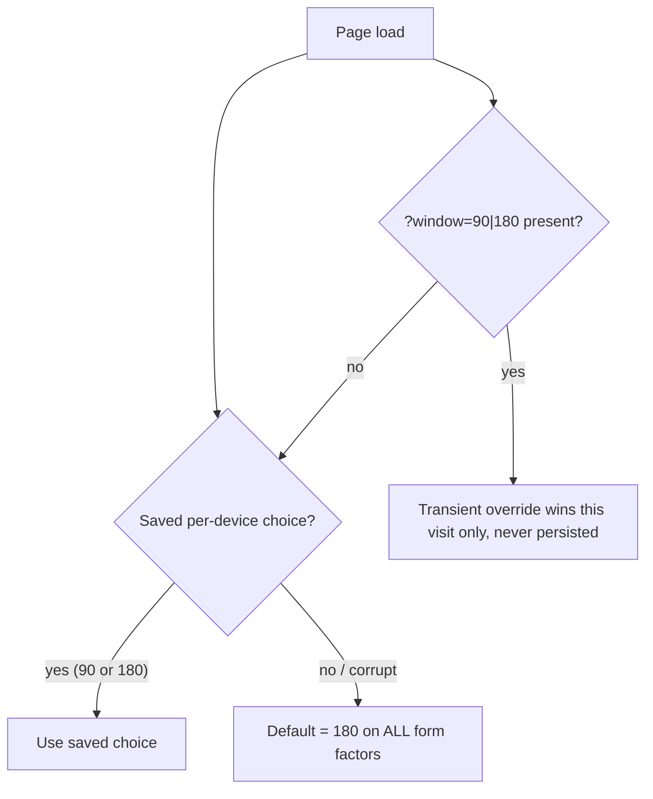

# Default the chart window to 180 days on every form factor

## Summary

The dashboard chart/summary window used to default to **90 days on mobile** and
**180 days on desktop**. Issue #711 asks for **180 days by default on all form
factors** unless the user has specifically opted into 90. This PR makes 180 the
single default everywhere while keeping the 90/180 toggle (and the per-device
saved choice / `?window=` deep link) fully working.

Closes #711.

### What changed

- `docs/chart_window_settings.js` — `MOBILE_WINDOW_DAYS_DEFAULT` raised from
  `90` to `180`, so a fresh mobile device (or a corrupt/missing stored value)
  now resolves to the full 180-day window, matching desktop. Mobile and desktop
  keep their own separate storage keys, so an explicit per-device choice is
  still honoured independently.
- `docs/projection.js` — `deviceWindowDays()` now defaults to `180` on **either**
  device (new `DEFAULT_WINDOW_DAYS` constant) instead of branching to 90 for
  mobile. The two selectable window sizes (90 and 180) are unchanged, so an
  explicit 90 opt-in still works on either device; `isMobile` is retained for
  call-site compatibility but no longer changes the default.
- `docs/app.js` — the `mobileWindowDays()` guard fallback (used when the storage
  helper is unavailable) now returns `180`, and the surrounding comments were
  corrected.
- `docs/index.html` — the static `checked` attribute moved from the 90-day radio
  to the 180-day radio, so the toggle shows 180 by default before JS runs and on
  every device.
- `README.md` — the `?window=` documentation now states the default is 180 on
  every form factor.

### Behaviour

## Evidence

This is a front-end (docs) change with **no** web-driver available in this
environment (Playwright MCP was not reachable), so visual capture was done by
inspecting the shipped markup and by the behavioural Deno tests that import the
real helpers.

- The shipped toggle now defaults to 180: in `docs/index.html` the
  `id="chartWindow180"` radio carries `checked` and `id="chartWindow90"` does
  not. This is pinned by
  `tests/chart_window_toggle_test.ts::index.html: default selection is 180 days`.
- The persistence and window-resolution helpers default to 180 on both devices,
  verified against the real modules (not mocks).

## Test Plan

Full Deno suite: **1317 passed, 0 failed**. `deno fmt`, `deno lint`, and
`deno check` all clean.

New / updated tests (business-logic change — the mobile default moved from 90 to
180, so assertions that pinned the old 90 default were updated and documented):

- `tests/chart_window_settings_test.ts` — mobile default is now 180 (empty /
  corrupt / throwing / no-storage all resolve to 180); junk normalises to 180; an
  explicit saved 90 is still honoured; new invariant test *"both mobile and
  desktop default to 180"*.
- `tests/projection_kernels_test.ts` — `deviceWindowDays`/`deviceWindowEnd`
  default to 180 on either device; explicit 90 still honoured.
- `tests/chart_summary_window_test.ts` — device default is 180; chart/summary
  still land on the identical end date for every window; explicit 90 compared
  explicitly.
- `tests/chart_actuals_window_test.ts` — the after-90 tail now shows for the
  mobile default (180) and for bad values (fall back to 180).
- `tests/chart_single_stock_axis_window_test.ts` — a bad window falls back to the
  180 default on both devices.
- `tests/market_comparison_90day_window_test.ts` — the fixed 90-day judgement
  window is now compared against an explicit 90-day chart window (the judgement
  window is unchanged; only the chart default moved).
- `tests/chart_window_toggle_test.ts` — default selection is now the 180-day
  radio.

## Notes

- `quality.sh` reports one **pre-existing, environmental** cargo test failure:
  `create_market_data_long_csv_writes_eight_column_rows` fails with *"No market
  data rows written for 2025-04-15 — is ../GRQ-shareprices2026Q2 available and up
  to date?"*. This depends on an external share-prices dataset that is not fresh
  in this environment and is **unrelated** to this change — no Rust files were
  touched. All other cargo checks and the entire Deno suite pass.
- The incidental `Cargo.lock` churn produced by `cargo update` inside
  `quality.sh` was reverted to keep this PR scoped to the front-end change.
