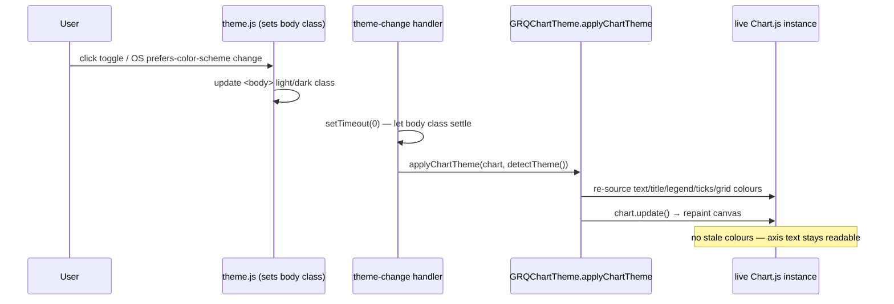

## Summary

Fixed a pre-existing Mermaid quality-gate failure carried over from PR #708. The
`sequenceDiagram` in `docs/archive/pr-summaries/pr-summary-708.md` contained a
`Note over` whose message text used an unescaped `;`, which Mermaid parses as a
statement separator and rejects. Replaced the `;` with ` — ` so the note renders
as intended.

Before:

```
Note over Chart: no stale colours; axis text stays readable
```

After:

```
Note over Chart: no stale colours — axis text stays readable
```

This is a documentation-only fix — no Rust or Deno source is touched. Closes #713.

## Evidence

The offending diagram now parses cleanly (no statement-separator `;` inside a
message). The corrected sequence diagram:



Full quality gate was run and passes: `cargo` build/clippy/check/test all green,
and `deno test --allow-read tests/*.ts` → **1317 passed, 0 failed**, with
`deno lint` and `deno check` clean.

## Test Plan

- No behavioural code changed; this is a Markdown/Mermaid documentation fix, so
  no new unit test applies.
- Ran `./quality.sh` (cargo + Deno gates) — all checks pass.
- Confirmed the corrected `Note over` line no longer contains a `;` inside the
  message text, so Mermaid no longer treats it as a statement separator.
