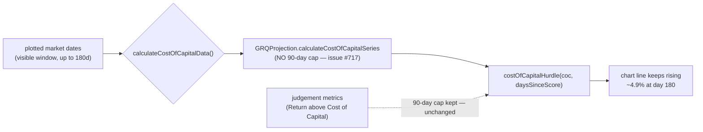

## Summary

The grey **Cost of Capital** line on a score's performance chart rose for the
first 90 days then ran dead flat to the end of the plotted data. Root cause:
`calculateCostOfCapitalData()` in `docs/app.js` capped days-since-score at 90
(`Math.min(daysSinceScore, 90)`), freezing the hurdle at (10% / 365) × 90 ≈
2.47% while points kept being plotted for every market date in the 180-day
visible window.

The fix removes the 90-day cap from the **chart series only**: the line now
keeps accruing at 10% p.a. to the end of the visible window (~4.9% at day 180),
staying comparable with the plotted actuals. The intentional 90-day cap on the
**judgement metrics** (per-stock and portfolio "Return above Cost of Capital")
is unchanged.

To do this cleanly, the accrual maths was extracted into a real shared kernel,
`GRQProjection.calculateCostOfCapitalSeries()` in `docs/projection.js` (the
repo's single-source-of-truth pattern for chart maths), reusing the existing
`costOfCapitalHurdle()` kernel with an **uncapped** elapsed-days value. The
chart now calls that kernel instead of inlining a capped formula. The stale
"Mobile detected - limiting cost of capital line to 90 days" debug log was
tidied away — mobile now defaults to 180 days (issue #711), so the message was
misleading. `APP_VERSION` was bumped 1.1.54 → 1.1.55 (via
`scripts/bump_version.ts`, keeping `sw.js`, `sw-register.js`, `index.html` and
`trend.html` aligned) so stale clients pick up the changed `app.js` /
`projection.js`.

The pop-out chart re-parents the same Chart.js canvas (issue #451) so it
inherits the fix; a 90-day window view is unaffected (the line ends at day 90,
so there is no flat segment to correct).

Closes #717.



## Evidence

No live screenshot: this is a Deno repo with no Playwright MCP or local browser
available, and adding Node/Playwright tooling would be a Deno regression. Visual
evidence below is generated deterministically from the **real** shared kernel
(`GRQProjection.calculateCostOfCapitalSeries`) for a score with ~113 days of
actuals — the short-history case from the issue. The dashed red line is the old
capped behaviour (flat at 2.47% after day 90); the solid grey line is the fixed
series (accrues to ~3.10% at day 113, and would reach ~4.9% at day 180).


Kernel output confirming the fix:

```
day90 fixed: 2.466   day113 fixed: 3.096   day113 old (capped): 2.466
```

## Test Plan

Added `tests/cost_of_capital_chart_series_test.ts`, which exercises the real
`GRQProjection.calculateCostOfCapitalSeries` kernel (not a reimplementation):

- **keeps accruing past day 90** — day-180 value (~4.93%) is strictly greater
  than the day-90 value (~2.47%); reproduces the flat-line regression and fails
  against the pre-fix capped maths.
- **strictly increasing across the window** — no flat tail anywhere in the
  series.
- **matches the shared hurdle kernel with NO cap** — each point equals
  `costOfCapitalHurdle(coc, elapsedDays)` for its uncapped elapsed days.
- **preserves the plotted date on each point**, and the score date itself
  accrues 0%.

Existing `tests/chart_data_test.ts` and the full `./quality.sh` gate (Deno lint,
fmt, type-check, all Deno tests, Rust tests) pass cleanly.
