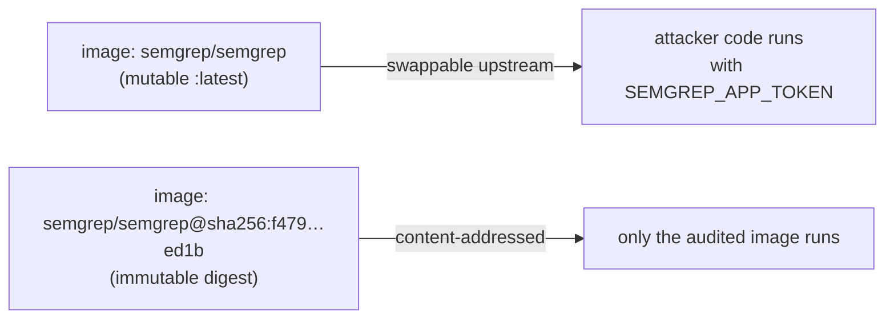

## Summary

Pinned the third-party `semgrep/semgrep` container image in
`.github/workflows/semgrep.yml` to an immutable `@sha256:` digest instead of
the mutable, bare `semgrep/semgrep` tag (which resolves to `:latest`). The
`semgrep` job exposes `SEMGREP_APP_TOKEN` to whatever code the image runs, so
a swapped upstream image was a real supply-chain risk. This brings the
container image in line with the existing rule that `uses:` actions are pinned
to 40-character commit SHAs. Closes #72.

The digest was resolved from the Docker Hub registry for
`semgrep/semgrep:latest` (an OCI multi-arch image index), and the
human-readable tag plus refresh instructions are kept in a comment for
traceability.

```yaml
    container:
      # semgrep/semgrep:latest — third-party image pinned to an immutable
      # digest (Issue #72). Refresh deliberately when bumping the scanner;
      # resolve with `docker buildx imagetools inspect semgrep/semgrep:latest`.
      image: semgrep/semgrep@sha256:f4791a54c891eabe1188248135574e6e03dfc31dfd3f3b747c7bec7079bfed1b
```

## Evidence

Backend/CI-only change — no web interface to screenshot. Verified via the
workflow test suite and the full quality gate (`./quality.sh`), which passed
cleanly (170 tests, 0 failed; fmt, lint, and check all green).



## Test Plan

- Added `tests/semgrep_workflow_test.ts::"Semgrep workflow pins the container
  image to a sha256 digest"` — parses the workflow YAML and asserts the
  container image matches `@sha256:<64 hex>`. It failed against the unpinned
  workflow and passes after the digest pin (TDD regression test).
- Existing `semgrep_workflow_test.ts` cases (image starts with
  `semgrep/semgrep`, runs `semgrep ci`, actions pinned to SHAs, etc.) continue
  to pass — the digest form still starts with `semgrep/semgrep`.
- `./quality.sh` passes: 170 tests, fmt, lint, and `deno check` all green.
