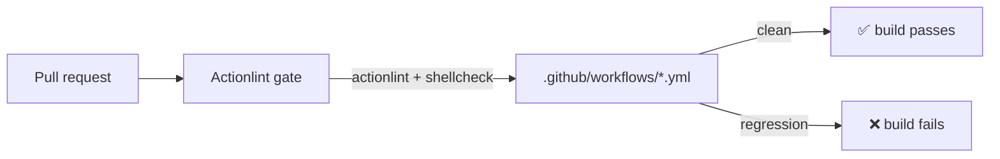

# Add CI lint gate for `github-actions` (actionlint)

## Summary

No workflow invoked `actionlint`, so workflow-YAML regressions (syntax errors,
invalid `${{ }}` expressions, unknown runner labels, shell mistakes inside
`run:` blocks) could merge undetected. This PR adds an **Actionlint** lint gate
that runs on every pull request and fails the build on such regressions,
mirroring the existing shellcheck / markdown-lint / gitleaks / semgrep gates.
Closes #725.

Changes:

- **`.github/workflows/actionlint.yml`** — new gate. Runs the official
  `rhysd/actionlint` image (entrypoint `actionlint`, `-color`) on
  `pull_request` and pushes to `main`/`master`. It is least-privilege
  (`contents: read`) and cancels superseded runs (Issue #139). The image is
  pinned to an immutable `sha256` digest rather than a mutable tag, matching the
  container pinning in `semgrep.yml` (supply-chain hardening, Issue #72). The
  image bundles `shellcheck`, so `run:` blocks are linted too.
- **`.github/workflows/a11y.yml`, `.github/workflows/ci.yml`** — fixed the
  pre-existing shellcheck findings actionlint surfaced, required for the new
  gate to pass cleanly: quoted `>> "$GITHUB_OUTPUT"` (SC2086) and replaced the
  unused loop variable `for i` with `for _` (SC2034). Behaviour is unchanged.
- **`README.md`** — documented the new workflow under _Workflows_ (also keeps
  the `documentation_accuracy_test` "README references every workflow" test
  green).

### Why the official image, pinned by digest

`rhysd/actionlint` publishes no `action.yml`, so `rhysd/actionlint@v1` is not a
usable `uses:` action. The repo's house style for tools without a first-party
action is a pinned, immutable artefact (see `semgrep.yml`'s digest-pinned
container). A `docker://rhysd/actionlint@sha256:…` step gives exactly that:
self-contained, no third-party review-bot dependency, and immutable.

## Evidence

Backend/CI change — no web UI to screenshot. Verified with the pinned linter
locally:

- `actionlint -color` → exit `0` after the a11y/ci fixes (exit `1` before,
  reporting the SC2086/SC2034 findings now fixed).
- `deno test --allow-read tests/*.ts` → **1328 passed, 0 failed**, including the
  7 new `tests/actionlint_workflow_test.ts` cases.
- `deno lint` / `deno check` / `markdownlint-cli2` / `bash -n` → clean.

## Test Plan

Added `tests/actionlint_workflow_test.ts` (structured assertions on the parsed
YAML, per Issue #202), covering:

- workflow file exists and parses with name `Actionlint`;
- triggers on `pull_request`;
- declares `contents: read`;
- declares a concurrency group that cancels superseded runs;
- a step actually invokes `actionlint`;
- every action is pinned to an immutable ref (40-char commit SHA or 64-char
  `sha256` digest).

These fail against the unfixed tree (no workflow file) and pass after it.
