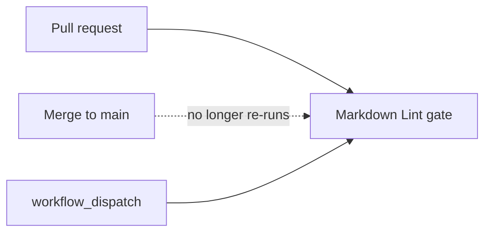

# PR Summary — Issue #726

## Summary

The Markdown Lint workflow (`.github/workflows/markdown-lint.yml`) is a
lint/checker that gates the pull request, but it still triggered on push to the
default branch (`main`/`master`). Once it becomes a required status check, every
merge re-ran the exact check that already passed on the PR — wasting CI minutes
and risking a red tick on the default branch for an already-green check.

This PR drops the `push:` trigger and replaces it with `workflow_dispatch`,
keeping the `pull_request` trigger so the linter still gates every PR and can be
run manually on demand. Deploy/publish workflows are unaffected — only this
checker changed.

Closes #726.

## Change

```diff
 on:
   pull_request:
     branches: ["*"]
-  push:
-    branches: [main, master]
+  workflow_dispatch:
```



## Evidence

Backend/CI-config change — no web interface to screenshot. Verified via the
workflow's Deno test suite (`tests/markdown_lint_workflow_test.ts`), which
parses the YAML and asserts the trigger invariants:

```
running 11 tests from ./tests/markdown_lint_workflow_test.ts
Markdown Lint workflow has correct triggers ... ok
Markdown Lint workflow does not trigger on push to the default branch ... ok
...
ok | 11 passed | 0 failed
```

`deno lint`, `deno check`, and `deno fmt` all pass on the modified test file.

## Test Plan

- Updated `tests/markdown_lint_workflow_test.ts::Markdown Lint workflow has
  correct triggers` — was asserting `"push" in on`; now asserts the checker
  keeps `pull_request` and gains `workflow_dispatch`. This existing test was
  modified because the business rule changed: a PR-gating linter must no longer
  fire on push to the default branch.
- Added `tests/markdown_lint_workflow_test.ts::Markdown Lint workflow does not
  trigger on push to the default branch` — a regression test that fails against
  the unfixed workflow (which had `push: branches: [main, master]`) and passes
  after the fix. It also tolerates a narrowed `push:` filter that excludes
  `main`/`master`, per the issue's alternative fix.
