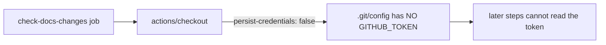

# Harden `check-docs-changes` checkout against credential persistence

## Summary

The `check-docs-changes` job in `.github/workflows/a11y.yml` ran
`actions/checkout` without `persist-credentials: false`. By default checkout
writes the workflow's `GITHUB_TOKEN` into `.git/config` as an auth header, where
any later step in the job could read it and act as the token. This job only
diffs `docs/` paths — it never pushes back to the repository or fetches a
private submodule — so it does not need the persisted credential. Added
`persist-credentials: false` to the checkout step to keep the token off disk and
shrink the blast radius of a compromised step. Closes #727.

## Evidence

Backend/CI change — no web interface to screenshot. Verified via the
workflow-assertion test suite (`deno test --allow-read tests/a11y_workflow_test.ts`),
16 passed / 0 failed. The new test fails against the unfixed workflow
(`persist-credentials` is `undefined`, not `false`) and passes after the fix.

## Test Plan

- Added `tests/a11y_workflow_test.ts::a11y check-docs-changes checkout does not
  persist credentials` — loads the workflow, finds the `check-docs-changes`
  `actions/checkout` step, and asserts `with.persist-credentials === false`.
- Re-ran the full `a11y_workflow_test.ts` suite: 16 passed, 0 failed.
- `deno fmt`, `deno lint`, and `deno check` clean on the modified test.
