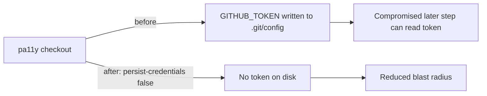

## Summary

The `pa11y` job in `.github/workflows/a11y.yml` checked out the repo with
`actions/checkout` but did not set `persist-credentials: false`. By default
checkout writes the workflow `GITHUB_TOKEN` into `.git/config` as an auth
header, where any later step — including a compromised dependency or injected
script — can read it and act as the token. This job only serves `docs/` and runs
`pa11y-ci`; it never pushes back to the repository or fetches a private
submodule, so it does not need the persisted credential. Added
`persist-credentials: false` to the pa11y checkout step to keep the token off
disk and shrink the blast radius of a compromised step. Closes #728.

## Evidence

Backend/CI-only change — no web interface to screenshot. Verified via the
workflow's Deno test suite (all 16 tests pass) and `actionlint`.



Test output:

```
ok | 16 passed | 0 failed
```

## Test Plan

- Added `tests/a11y_workflow_test.ts::"a11y pa11y checkout does not persist
  credentials"` — parses the workflow, finds the pa11y job's `actions/checkout`
  step, and asserts `with.persist-credentials === false`. Confirmed it fails
  against the unfixed workflow (`undefined`) and passes after the fix.
- Re-ran the full `tests/a11y_workflow_test.ts` suite — all 16 tests pass.
- Ran `actionlint` on the workflow — clean.
