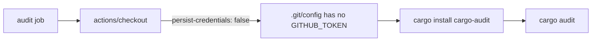

## Summary

The `audit` job in `.github/workflows/cargo-audit.yml` ran `actions/checkout`
without `persist-credentials: false`. By default checkout writes the workflow's
`GITHUB_TOKEN` into `.git/config` as an auth header, where any later step in the
job — including a compromised dependency or injected script — can read it and
act as the token. The audit job only reads the tree to run `cargo-audit`; it
never pushes back to the repository or fetches a private submodule, so it does
not need the persisted credential.

Added `persist-credentials: false` to the audit checkout step so the token is no
longer written to disk, shrinking the blast radius of any compromised later
step. Closes #729.

## Evidence

Backend/CI change only — no web interface to screenshot. Verified via the Deno
workflow test suite, which parses the workflow YAML and asserts the invariant.



Test run:

```
deno test --allow-read tests/cargo_audit_workflow_test.ts
ok | 8 passed | 0 failed
```

## Test Plan

- Added `tests/cargo_audit_workflow_test.ts::Cargo Audit audit checkout does not
  persist credentials`, which fails against the unfixed workflow (checkout has
  no `with.persist-credentials`) and passes once `persist-credentials: false` is
  set on the audit checkout step.
- Existing Cargo Audit workflow tests (YAML validity, triggers, permissions,
  job structure, SHA pinning, concurrency) continue to pass.
