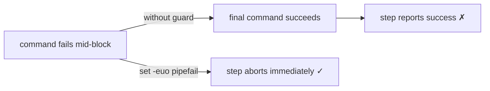

## Summary

Added `set -euo pipefail` as the first line of the two multi-line bash `run:`
blocks in `.github/workflows/ci.yml` so a command that fails mid-block (or an
unset variable) aborts the step instead of being masked by the success of the
final command. The guard makes fail-fast intent explicit and adds unset-variable
protection (`-u`) on top of GitHub's default shell flags. Closes #73.

Affected steps:

- `check-changes` → **Check for changes** — the `git diff` / `grep` pipeline that
  writes `rust`/`docs` flags to `$GITHUB_OUTPUT`.
- `build` → **Generate CycloneDX SBOM** — the `cargo install` plus `find`/`cp`
  fallback that produces the component inventory; a silent failure here could
  otherwise ship a build without a valid SBOM.

Both blocks remain correct under the stricter flags: every `grep`/`find` runs
inside an `if` condition (so `-e` does not trip on a non-match) and all shell
variables are quoted and always assigned (so `-u` is satisfied).

## Evidence

CI-workflow change with no web interface to screenshot. Verified by the
behaviour-level tests in `tests/ci_workflow_test.ts`, which parse the workflow
YAML, locate each target step by name, and assert the first non-empty line of
its `run` block is exactly `set -euo pipefail`.



Test run:

```
deno test --allow-read tests/ci_workflow_test.ts
ok | 10 passed | 0 failed
```

`./quality.sh` passes cleanly: `ok | 170 passed (57 steps) | 0 failed`.

## Test Plan

- Added `tests/ci_workflow_test.ts::multi-line bash run blocks begin with set -euo pipefail`
  — parses `ci.yml`, resolves the `check-changes`/Check for changes and
  `build`/Generate CycloneDX SBOM steps, and asserts each multi-line `run` block
  starts with `set -euo pipefail`. Confirmed it fails against the unfixed
  workflow and passes after the fix.
- All existing CI-workflow tests continue to pass.
