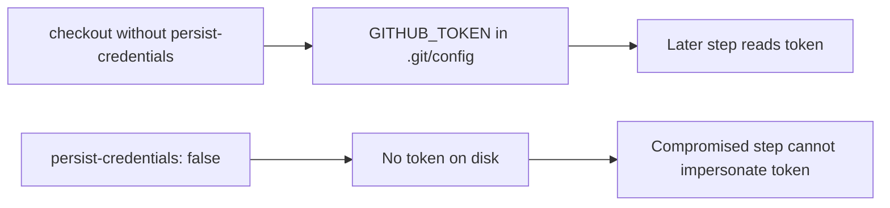

## Summary

The `build` job in `.github/workflows/ci.yml` ran `actions/checkout` without
`persist-credentials: false`. By default checkout writes the workflow's
`GITHUB_TOKEN` into `.git/config` as an auth header, where any later step in the
job — including a compromised dependency or injected script — can read it and
act as the token. The build job only checks out, compiles the release binary,
generates a CycloneDX SBOM and uploads artifacts; it never pushes back to the
repository or fetches a private submodule, so it does not need the persisted
credential. Added `persist-credentials: false` to the build checkout step to
keep the token off disk and narrow the blast radius of any compromised step.
Closes #730.

## Evidence

Backend/CI-only change — no web interface to screenshot. Verified via the
workflow unit tests, which parse `ci.yml` and assert on the build job's checkout
configuration.

## Test Plan

- Added `tests/ci_workflow_test.ts::"build job checkout does not persist credentials"`,
  which parses `.github/workflows/ci.yml` and asserts the build job's
  `actions/checkout` step sets `persist-credentials: false`. It fails against the
  unfixed workflow (`undefined`) and passes after the fix.
- Ran `deno test --allow-read tests/ci_workflow_test.ts` — 14 passed, 0 failed.
- Ran `./quality.sh` — all checks pass.
