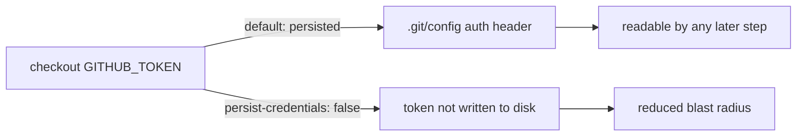

## Summary

The `deploy-pages` job in `.github/workflows/ci.yml` ran `actions/checkout`
without `persist-credentials: false`. By default checkout writes the workflow's
`GITHUB_TOKEN` into `.git/config` as an auth header, where any later step in the
job could read it. The job only checks out `./docs` to build the GitHub Pages
artifact — it never pushes back to the repository or fetches a private
submodule — so it does not need the persisted credential.

Added `persist-credentials: false` to the `deploy-pages` checkout step so the
token is not written to disk, matching the existing hardening on the
`check-changes` (Issue #731) and `build` (Issue #730) checkouts. Closes #732.



## Evidence

Backend/CI-only change — no web interface to screenshot. Verified via the Deno
workflow tests:

```
running 15 tests from ./tests/ci_workflow_test.ts
...
deploy-pages checkout does not persist credentials ... ok
...
ok | 15 passed | 0 failed
```

## Test Plan

- Added `tests/ci_workflow_test.ts::deploy-pages checkout does not persist credentials`,
  which parses the workflow YAML and asserts the `deploy-pages` checkout step
  sets `persist-credentials: false`. It fails against the unfixed workflow
  (no `with` block) and passes after the fix.
- All 15 existing `ci_workflow_test.ts` tests continue to pass, including
  `deploy-pages keeps its elevated per-job permissions` and
  `deploy-pages stays main-only`, confirming no regression to the Pages deploy.
