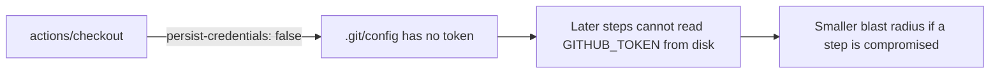

# PR Summary — Issue #733

## Summary

The `test` job in `.github/workflows/ci.yml` checked out the repository with
`actions/checkout` but did not set `persist-credentials: false`. By default
`actions/checkout` writes the workflow's `GITHUB_TOKEN` into `.git/config` as an
auth header, where any later step in the same job (including a compromised
dependency) could read it and act as the token.

The `test` job only builds and runs the Rust quality checks
(cargo fmt/clippy/check/test) — it never pushes back to the repository or fetches
a private submodule, so it does not need the persisted credential. Added
`persist-credentials: false` to the `test` job's checkout step, matching the
hardening already applied to the `check-changes`, `build`, and `deploy-pages`
jobs (issues #730, #731, #732).

Closes #733.

## Evidence

Backend/CI-only change — no web interface to screenshot. Verified via the deno
test suite and `actionlint`:

- `deno test --allow-read tests/ci_workflow_test.ts` → `16 passed | 0 failed`.
- Regression check: reverting the workflow fix makes the new
  `test job checkout does not persist credentials` test **FAIL**; with the fix it
  passes.
- `actionlint .github/workflows/ci.yml` → clean.

## Test Plan

- Added `tests/ci_workflow_test.ts::test job checkout does not persist credentials`,
  which parses `ci.yml` and asserts the `test` job's `actions/checkout` step sets
  `persist-credentials: false`. This test fails against the unfixed workflow and
  passes after the fix.
- Existing CI workflow tests continue to pass (16/16).
