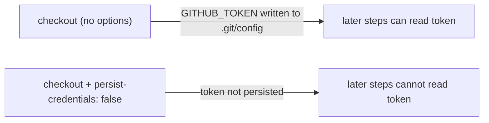

## Summary

The `quality` job in `.github/workflows/deno-quality.yml` checked out the
repository with `actions/checkout` but did not set `persist-credentials: false`.
By default checkout writes the workflow's `GITHUB_TOKEN` into `.git/config` as an
auth header, where any later step in the job — including a compromised dependency
or an injected script — can read it and act as the token. This job only runs the
Deno quality checks (lint, fmt, check, audit, test) and uploads coverage; it
never pushes back to the repository or fetches a private submodule, so it does
not need the persisted credential. Adding `persist-credentials: false` keeps the
token off disk and narrows the blast radius of any compromised step.

Closes #734.

## Evidence

Backend/CI-only change — no web interface to screenshot. Verified via the Deno
workflow test suite, which parses the workflow YAML and asserts the checkout
step sets `persist-credentials: false`.

Before → after (checkout step of the `quality` job):



Test run:

```
deno test --allow-read tests/deno_quality_workflow_test.ts
ok | 10 passed | 0 failed
```

## Test Plan

- Added `tests/deno_quality_workflow_test.ts::"Deno Quality workflow checkout does not persist credentials"`,
  which reproduces #734 — it fails against the unfixed workflow (`persist-credentials`
  is `undefined`) and passes once the option is set to `false`.
- Full `./quality.sh` gate passes cleanly (lint, fmt, type check, tests).
