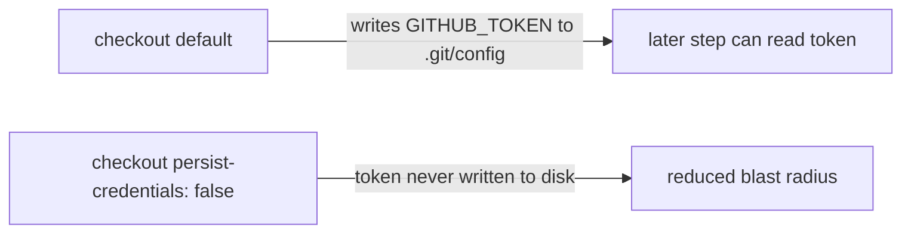

## Summary

Hardened the `dependency-review` GitHub Actions workflow so its `actions/checkout`
step no longer persists the workflow `GITHUB_TOKEN` into `.git/config`. By default
`actions/checkout` writes the token as an auth header on disk, where any later step
in the job — including a compromised dependency or injected script — could read it
and act as the token. The `dependency-review` job only checks out so
`dependency-review-action` can inspect the dependency diff; it never pushes back to
the repo or fetches a private submodule, so the persisted credential is unnecessary
and only widens the blast radius of a compromised step. Added
`persist-credentials: false` to close it. Closes #735.

This mirrors the established pattern already applied to `deno-quality.yml`
(Issue #734) and other workflows in this repo.



## Evidence

Backend/CI change only — no web interface to screenshot. Verified via the Deno test
suite: the new test fails against the unpatched workflow (`undefined` vs expected
`false`) and passes after adding `persist-credentials: false`.

```
Dependency Review workflow checkout does not persist credentials ... ok
ok | 5 passed | 0 failed
```

`./quality.sh` passes cleanly with the change.

## Test Plan

- Added `tests/dependency_review_workflow_test.ts::"Dependency Review workflow
  checkout does not persist credentials"` — parses the workflow YAML, locates the
  `dependency-review` job's `actions/checkout` step, and asserts
  `with.persist-credentials === false`. This reproduces the finding (fails before
  the fix) and guards against regression.
- Existing dependency-review workflow tests (file exists, valid YAML, SHA pinning,
  concurrency) continue to pass.
