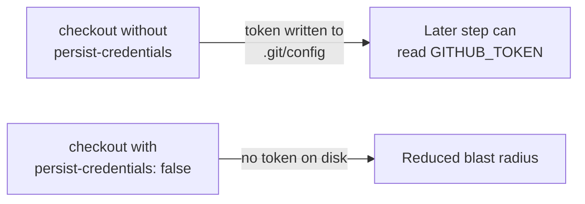

## Summary

Hardened the `dependency-review` GitHub Actions job so its `actions/checkout`
step no longer persists the workflow's `GITHUB_TOKEN` into `.git/config`. The
job only reviews dependency changes — it never pushes back to the repo or
fetches a private submodule — so the persisted credential is unnecessary and
only widens the blast radius of any compromised later step. Added
`persist-credentials: false` to the checkout, matching the pattern already used
across the repo's other workflows (`deno-quality.yml`, `cargo-audit.yml`,
`ci.yml`, `a11y.yml`). Closes #735.

## Evidence

Backend/CI-only change — no web interface to screenshot. Verified by the added
unit test and the full quality gate (`./quality.sh`), which passed cleanly.

## Test Plan

- Added `tests/dependency_review_workflow_test.ts::Dependency Review workflow
  checkout does not persist credentials`, which parses the workflow YAML and
  asserts the `dependency-review` job's checkout step sets
  `persist-credentials: false`. This fails against the unfixed workflow and
  passes after the fix.
- Ran the targeted test file (5 passed) and the full `./quality.sh` gate (lint,
  fmt, `deno check`, all Deno tests) — all green.
