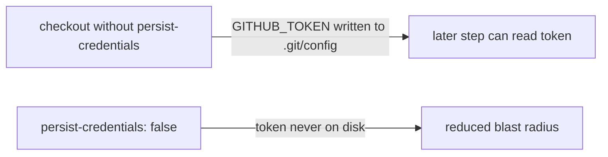

# Harden markdown-lint checkout — do not persist credentials

## Summary

The `markdownlint` job in `.github/workflows/markdown-lint.yml` ran
`actions/checkout` without `persist-credentials: false`. By default checkout
writes the workflow's `GITHUB_TOKEN` into `.git/config` as an auth header, where
any later step in the job — including a compromised dependency — could read it
and act as the token. This job only lints markdown; it never pushes back to the
repository nor fetches a private submodule, so it does not need the persisted
credential.

Added `persist-credentials: false` to the checkout step so the token is not
written to disk, matching the pattern already used across `ci.yml`, `a11y.yml`,
`dependency-review.yml`, `cargo-audit.yml`, and `deno-quality.yml`. Added a
regression test asserting the invariant. Closes #736.

## Evidence

Backend/CI-only change — no web interface to screenshot. Verified via the test
suite: the new test fails against the unfixed workflow and passes after the fix.

```
Markdown Lint workflow checkout does not persist credentials ... ok
ok | 12 passed | 0 failed
```

`./quality.sh` passes cleanly.



## Test Plan

- Added `tests/markdown_lint_workflow_test.ts::"Markdown Lint workflow checkout
  does not persist credentials"` — parses the workflow YAML and asserts the
  `markdownlint` job's `actions/checkout` step sets `persist-credentials: false`.
- Ran the full `markdown_lint_workflow_test.ts` suite (12 passed) and
  `./quality.sh` (passes).
