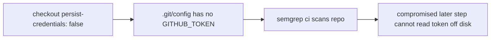

## Summary

Hardened the `semgrep` job's checkout in `.github/workflows/semgrep.yml` so it no
longer persists the workflow `GITHUB_TOKEN` to disk. The job only checks out the
repository to run `semgrep ci` — it never pushes back or fetches a private
submodule — so it does not need the credential written into `.git/config`.
Leaving the token on disk needlessly widens the blast radius of any compromised
later step (a malicious dependency could read it and act as the token).

Added `persist-credentials: false` to the `actions/checkout` step. This mirrors
the identical fix already applied to the cargo-audit workflow (Issue #729).

Closes #737.

## Evidence

Backend/CI change only — no web interface to screenshot. Verified via a new
unit test that parses the workflow YAML and asserts the checkout step sets
`persist-credentials: false`.



Test run:

```
Semgrep checkout does not persist credentials ... ok
ok | 9 passed | 0 failed
```

`actionlint .github/workflows/semgrep.yml` — exit 0.

## Test Plan

- Added `tests/semgrep_workflow_test.ts::"Semgrep checkout does not persist credentials"`,
  which reproduces #737 (fails against the unfixed workflow, passes after the
  fix) by asserting the `semgrep` job's `actions/checkout` step declares
  `persist-credentials: false`.
- Ran the full `tests/semgrep_workflow_test.ts` suite: 9 passed, 0 failed.
- `deno fmt`, `deno lint`, and `deno check` clean on the modified test file.
