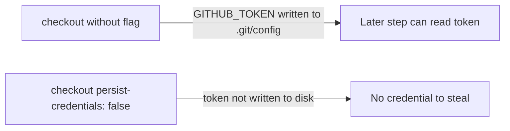

## Summary

Hardened the `shellcheck` GitHub Actions job so its `actions/checkout` step no
longer persists the workflow's `GITHUB_TOKEN` into `.git/config`. The job only
runs ShellCheck — it never pushes back to the repository or fetches a private
submodule — so it does not need the persisted credential. Leaving the token on
disk widens the blast radius of any compromised later step (a malicious
dependency could read it and act as the token). Added
`persist-credentials: false` to the checkout step, matching the pattern already
applied across the other workflows in this repo. Closes #738.

## Evidence

Backend/CI-only change — no web interface to screenshot.

- `actionlint .github/workflows/shellcheck.yml` → clean.
- `deno test tests/shellcheck_workflow_test.ts` → 6 passed, 0 failed, including
  the new `ShellCheck workflow checkout does not persist credentials` test.

## Test Plan

- Added `tests/shellcheck_workflow_test.ts::ShellCheck workflow checkout does not
  persist credentials`, which parses the workflow YAML and asserts the
  `actions/checkout` step in the `shellcheck` job sets `persist-credentials:
  false`. This test fails against the unfixed workflow and passes after the fix.
- Existing ShellCheck workflow tests continue to pass (file exists, YAML parses,
  triggers on `pull_request`, read-only contents permission, concurrency group).
