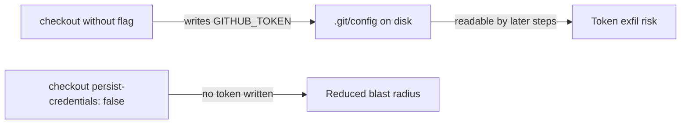

## Summary

The `shellcheck` job's `actions/checkout` step ran without
`persist-credentials: false`, so `actions/checkout` wrote the workflow
`GITHUB_TOKEN` into `.git/config` as an auth header. Any later step in the job —
including a compromised dependency or injected script — could read it and act as
the token. The job only reads the repo to scan it (it never pushes back or
fetches a private submodule), so the persisted credential is unnecessary and
only widens the blast radius.

Added `persist-credentials: false` to the checkout step in
`.github/workflows/shellcheck.yml`, mirroring the pattern already proven in
`semgrep.yml` and other workflows in this repo. Closes #738.

## Evidence

Backend/CI-config change only — no web interface to screenshot. Verified via the
Deno workflow test suite:

- New test `ShellCheck checkout does not persist credentials` failed against the
  unfixed workflow (`persist-credentials` was `undefined`) and passes after the
  fix.
- Full Deno suite: `1340 passed | 0 failed`.

## Test Plan

- Added `tests/shellcheck_workflow_test.ts::ShellCheck checkout does not persist credentials`
  — parses the workflow YAML, finds the `actions/checkout` step in the
  `shellcheck` job, and asserts `with.persist-credentials === false`. This
  reproduces #738 (fails pre-fix, passes post-fix).
- Existing ShellCheck workflow tests (file exists, valid YAML, `pull_request`
  trigger, read-only `contents` permission, concurrency cancellation) continue
  to pass.
