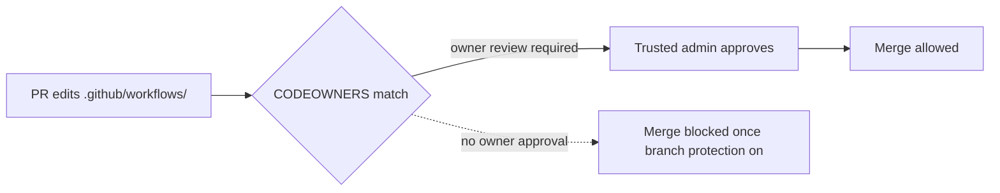

# PR Summary — Issue #74

## Summary

This repository runs **privileged workflows** but shipped no `CODEOWNERS` file,
so no required reviewer guarded changes to `.github/workflows/`. A self-approving
or compromised account could quietly alter a workflow that runs with
`id-token: write` and non-`GITHUB_TOKEN` secrets — the tj-actions / OIDC-theft
attack shape.

This change adds a `.github/CODEOWNERS` file that places a trusted reviewer on
the privileged CI/CD surface, documents the recommended branch-protection
settings, and adds tests that validate the governance file. Closes #74.

**Owner choice.** The issue suggested `@stSoftwareAU/maintainers`, but that team
does not exist and no org team other than the bot's own `vibe-coders` has write
access to this repo. A CODEOWNERS rule whose owner lacks write access is
silently ignored by GitHub, so the file instead names the repository's existing
admin collaborators (`@nleck`, `@Green-Beret`, `@stservice`) — valid owners and,
deliberately, trusted humans rather than the bot account. The file comments note
how to swap in a dedicated team if one is later granted access.

**Branch protection.** Enabling "require review from Code Owners" is a
repository-administrator setting that is not stored in the tree and cannot be set
from a PR (the worker has push, not admin). The recommended settings are
documented in `SECURITY.md` for an admin to apply:

- Require at least one approving PR review.
- Require review from Code Owners.
- Block direct pushes and force-pushes to the default branch.
- Require linear history.

## Evidence

This is a governance/config change with no web interface to screenshot. Evidence
is the new test suite, which parses the real `CODEOWNERS` file and asserts on its
contents.



Test run:

```text
deno test --allow-read tests/*.ts
ok | 176 passed (57 steps) | 0 failed
```

## Test Plan

Added `tests/codeowners_test.ts`, which exercises a real CODEOWNERS parser
against the committed file:

- `CODEOWNERS exists at a GitHub-recognised location` — file present at
  `CODEOWNERS`, `.github/CODEOWNERS`, or `docs/CODEOWNERS`.
- `CODEOWNERS defines a default owner for the whole repository` — a `*` rule
  with at least one owner.
- `CODEOWNERS guards the privileged .github/workflows/ surface` — a rule covers
  the workflows directory with at least one owner.
- `CODEOWNERS guards the .github/actions/ surface` — a rule covers the actions
  directory with at least one owner.
- `CODEOWNERS owners are syntactically valid GitHub handles` — every owner is a
  valid `@user` or `@org/team` handle.

The suite was confirmed to fail before the `CODEOWNERS` file was added (TDD red)
and pass after. The existing `tests/security_md_test.ts` continues to pass with
the `SECURITY.md` additions.
