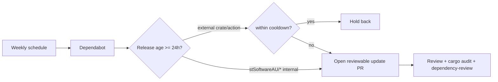

# PR Summary — Issue #75

## Summary

The repository had **no automated dependency-update tooling for the Cargo
ecosystem**: no `.github/dependabot.yml` and no `renovate.json`. Cargo crates
(including security patches) were never surfaced as tracked, reviewable update
PRs — they only floated invisibly via an in-CI `cargo update`. The Deno
ecosystem was already covered by `deno-outdated.yml`.

This PR adds `.github/dependabot.yml` configuring Dependabot to open weekly,
reviewable update PRs for:

- the **Cargo** crate ecosystem (`Cargo.toml` / `Cargo.lock`), and
- the **GitHub Actions** ecosystem (keeps action SHAs current).

Each ecosystem applies a **24-hour `cooldown`** (release-age quarantine) so a
freshly-published — possibly hijacked — crate or action is held back rather than
auto-bumped within the same window. Internal `stSoftwareAU/*` dependencies are
**excluded from the cooldown** so they update immediately, mirroring the
`minimumDependencyAge` policy `deno.json` applies to the Deno ecosystem.

Dependabot's native `cooldown` was chosen over a hand-rolled
`cargo update` workflow because Cargo has no built-in release-age gate, whereas
`cooldown` enforces the 24h quarantine declaratively with an audit trail.

Closes #75

## Evidence

This is a CI/config-only change with no web interface to screenshot. Verified
via the Deno test suite, which parses the new config and asserts its structure.

```
$ deno test --allow-read tests/dependabot_config_test.ts
running 5 tests from ./tests/dependabot_config_test.ts
dependabot config file exists ... ok
dependabot config parses as YAML and declares version 2 ... ok
dependabot config covers the Cargo ecosystem on a weekly schedule ... ok
dependabot Cargo updates are gated behind a release-age quarantine (Issue #75) ... ok
dependabot config covers the GitHub Actions ecosystem with internal exclusion ... ok
ok | 5 passed | 0 failed
```

Full suite: `ok | 182 passed | 0 failed`. Markdown lint: `0 error(s)`.

### Dependency-update flow



## Test Plan

- Added `tests/dependabot_config_test.ts` (TDD — written failing first):
  - config file exists
  - parses as YAML and declares `version: 2`
  - covers the `cargo` ecosystem at `/` on a weekly schedule with a positive
    `open-pull-requests-limit`
  - Cargo updates declare a `cooldown` with `default-days >= 1` (24h quarantine)
  - covers the `github-actions` ecosystem and excludes `stSoftwareAU/*` from the
    cooldown
- Confirmed the full Deno suite (182 tests) and markdown lint pass.
