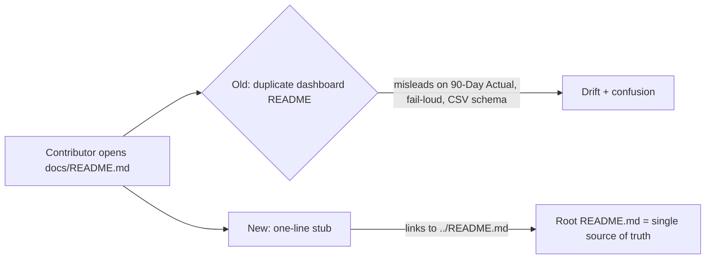

## Summary

`docs/README.md` was a stale, duplicate dashboard README that directly
contradicted the declared source of truth (root `README.md`) on the tool's most
important framing:

- **"Current price" vs "90-Day Actual".** It promised *current prices* and
  *"Tracks real market performance since prediction date"*, whereas the root
  README (lines 7-18) states the tool **never** shows a live/current price and
  labels the figure **"90-Day Actual"** so it cannot be mistaken for a live
  quote (issues #683, #539, #542).
- **Silent vs loud missing-data handling.** It described a soft *"No data
  available yet"* placeholder, which the root README ("Market data fails loudly,
  not silently") documents was **replaced** by a loud red `.market-data-error`
  data-fault state.
- **Stale CSV schema.** It described the market CSV as *date, ticker, high, low,
  open, close* — omitting the `volume` and `split_coefficient` columns the
  current backend relies on for the Low-Volume and Split-Aware logic.

`docs/README.md` is not referenced by any other doc and is not the GitHub Pages
entry point (`docs/index.html` is), so it only served to mislead any agent or
contributor who opened it first.

**Fix:** reduced `docs/README.md` to a one-line stub pointing at the root
`README.md` as the single source of truth, so the two copies cannot drift apart.
Added a regression test guarding that the stub stays small, stays a pointer, and
does not reintroduce the contradicting prose.

Closes #758.

## Evidence

This is a documentation/CLI change with no web interface to screenshot. The
change is verified by the new Deno test below.



New test run:

```
running 3 tests from ./tests/docs_readme_stub_test.ts
docs/README.md is a small stub, not a duplicate dashboard README ... ok
docs/README.md points to the root README as the single source of truth ... ok
docs/README.md does not contradict the root README ... ok
ok | 3 passed | 0 failed
```

`./quality.sh` passes cleanly.

## Test Plan

- Added `tests/docs_readme_stub_test.ts`:
  - `docs/README.md is a small stub, not a duplicate dashboard README` — asserts
    the file is at most 6 non-blank lines.
  - `docs/README.md points to the root README as the single source of truth` —
    asserts it links to `../README.md` and names it the source of truth.
  - `docs/README.md does not contradict the root README` — asserts the
    contradicting prose (`current price(s)`, `No data available yet`, the
    "tracks real market performance" claim, the stale CSV schema) is not
    reintroduced.
- These tests failed against the old duplicate README and pass against the stub.
