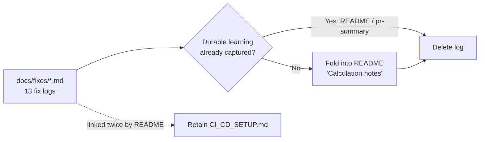

# PR Summary — Prune stale `docs/fixes/` logs (#759)

## Summary

`docs/fixes/` was a second, ad-hoc learnings store maintained in parallel with
the README and the `docs/archive/pr-summaries/` archive. It had drifted from
reality — `CORS_PROXY_ISSUE_FIX.md` documented public CORS proxies the project
deliberately dropped (fetch is now first-party server-side, #93), and
`DEPRECATED_ACTIONS_FIX.md` fixed `.github/workflows/rust.yml`, a workflow that
no longer exists.

This PR removes all 13 fix logs after confirming each one's durable learning is
captured in the README or an existing pr-summary. `docs/fixes/CI_CD_SETUP.md` is
**retained** because the root README links it twice (Setup + Support).

The three durable learnings that were **not** already captured are folded into a
new **Calculation notes** section in the README first, then their logs removed —
no negative or durable learning is dropped:

- **Annualised performance** — compound growth over the actual elapsed days
  (capped at 90), never a simple `× 4`.
- **Split-reconciliation thresholds** — the plausibility numbers
  (`1.0 ≤ c ≤ 10.0`, 5-trading-day de-dup, cumulative cap 50, ±15% price-ratio
  cross-check) that live in `src/utils.rs` and `docs/projection.js` as the
  single source of truth.
- **Late-stage projection confidence** — the R² threshold tiers that relax as a
  prediction matures (still live in `docs/app.js`).

Live code/test comments that cited the deleted logs now point at the README.
Point-in-time investigations remain preserved in their pr-summaries
(`pr-summary-93/291/292/370/587/600`), so the history is not lost.

Closes #759

## Evidence

Documentation / test change — no web UI to screenshot. Verified by the Deno
suite (`deno test --allow-read tests/*.ts`): **1349 passed, 0 failed**, plus
`deno lint`/`deno check`/`deno fmt --check`, `markdownlint-cli2` (0 errors) and
`cargo check`.

## Test Plan

- **`tests/repo_root_layout_test.ts`** (updated) — splits fix notes into
  `RETAINED` (CI_CD_SETUP.md must exist under `docs/fixes/`) and `PRUNED` (the
  other 12 must be gone from both the repo root and `docs/fixes/`).
- **`tests/docs_fixes_learnings_test.ts`** (new) — asserts the README folds the
  annualisation formula, the split thresholds and the confidence tiers; that no
  abandoned CORS-proxy relay string (`allorigins.win`, `cors-anywhere`,
  `thingproxy`) lingers in `README.md` or `docs/app.js`; and that the retained
  `CI_CD_SETUP.md` link target resolves.
- **`tests/klac_split_distortion_test.ts`**, **`tests/fixtures/README.md`** —
  reference comments repointed to the README; existing assertions unchanged and
  still green.
