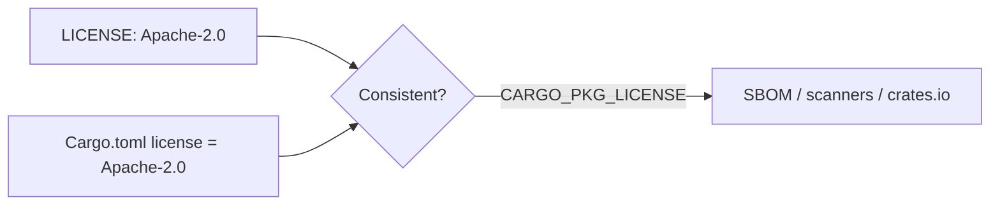

## Summary

Declared the SPDX `license` field in `Cargo.toml` so the manifest's
machine-readable licence metadata matches the committed Apache-2.0 `LICENSE`
file. Previously `Cargo.toml` had no `license` field, so SBOM generators
(`cargo-cyclonedx` in `ci.yml`), dependency scanners and crates.io could not
determine the crate's licence, and the declared licence drifted silently from
the committed file.

The fix adds `license = "Apache-2.0"` to the `[package]` table — the SPDX short
code matching `LICENSE` ("Apache License, Version 2.0").

Closes #76.

## Evidence

Backend/manifest-only change — no web interface to screenshot.

`CARGO_PKG_LICENSE` is the value Cargo derives from the manifest at compile
time and the value tooling reads. Verified the new tests pass:

```
running 2 tests
test manifest_declares_apache_2_0_spdx_licence ... ok
test manifest_licence_matches_committed_license_file ... ok

test result: ok. 2 passed; 0 failed
```

Full `./quality.sh` passes cleanly (cargo fmt/clippy/check/test + tarpaulin +
Deno test/lint/check; 177 Deno tests passed).



## Test Plan

Added `tests/license_metadata_test.rs`:

- `manifest_declares_apache_2_0_spdx_licence` — asserts `CARGO_PKG_LICENSE`
  equals the SPDX code `Apache-2.0`. Fails when the manifest has no `license`
  field (the unfixed state, where the value is empty).
- `manifest_licence_matches_committed_license_file` — asserts the manifest
  licence agrees with the committed `LICENSE` file (Apache License, Version
  2.0), so the two cannot drift silently.
