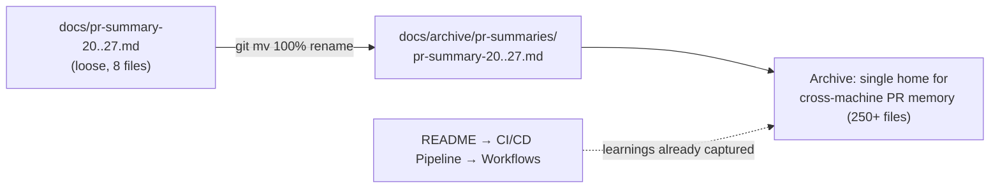

## Summary

Consolidated eight loose PR-summary files that sat in `docs/` root into the
durable archive `docs/archive/pr-summaries/`, where the other 250+ summaries
already live. Each documents the addition of one CI/CD workflow — Gitleaks
(#20), Semgrep (#21), Dependency Review (#22), Markdown Lint (#23), Cargo Audit
(#24), Deno Outdated (#25), Deno Quality (#26) and ShellCheck (#27).

The issue's preferred, lossless option was taken: the files were **moved** via
`git mv` (100% rename, no content change), not deleted, so no learning is lost —
including the "requires the `GITLEAKS_LICENSE` secret" caveat in #20. Their
durable learnings are also already reflected in the README's "CI/CD Pipeline →
Workflows" list, so nothing is left stranded outside the archive.

A regression test (`tests/pr_summary_archive_layout_test.ts`) pins the new
layout so a future edit cannot scatter these summaries back into `docs/` root.

Closes #760.

## Evidence

Backend/docs-only change — no web interface to screenshot. Verification is the
Deno test suite plus the git rename record.



New test output:

```
relocated PR summaries no longer sit loose in docs/ root (#760) ... ok
relocated PR summaries live in the archive (#760) ... ok
moved summaries retain their durable learnings (#760) ... ok
ok | 3 passed | 0 failed
```

Full Deno suite: `ok | 1352 passed (79 steps) | 0 failed`.

## Test Plan

Added `tests/pr_summary_archive_layout_test.ts`:

- **relocated PR summaries no longer sit loose in docs/ root** — asserts none of
  `docs/pr-summary-20.md` … `docs/pr-summary-27.md` remain in `docs/` root.
- **relocated PR summaries live in the archive** — asserts each summary now
  exists as a file under `docs/archive/pr-summaries/`.
- **moved summaries retain their durable learnings** — asserts the
  `GITLEAKS_LICENSE` caveat survives in `pr-summary-20.md` and every file keeps
  its `Closes #NN` reference (whitespace-normalised to tolerate line wrapping),
  proving the move preserved content rather than stubbing it.
