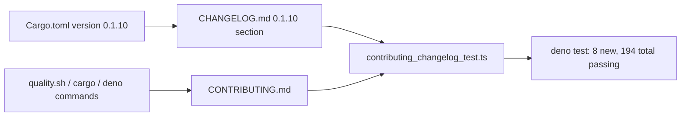

## Summary

Completes the repository's documentation floor by adding the two missing
contributor-facing root files. The repo already published `README.md`,
`LICENSE`, and `SECURITY.md` but had no `CONTRIBUTING.md` or `CHANGELOG.md`.
Closes #77.

- **`CONTRIBUTING.md`** — documents the build, test, and lint commands for both
  sides of this hybrid project (Rust via `cargo`, the dashboard/tests via
  `deno`), anchors on the existing `quality.sh` local gate, and describes the
  TDD pull-request workflow. Notes the Australian-English convention and points
  at `SECURITY.md`.
- **`CHANGELOG.md`** — follows the [Keep a Changelog](https://keepachangelog.com/)
  format with a Semantic Versioning reference, an `[Unreleased]` section, and a
  `[0.1.10]` section seeded from the current `Cargo.toml` version.

## Evidence

This is a docs + test-suite change with no web interface to screenshot.
Verification is via the new Deno tests and the existing quality gates.

- New tests pass: `deno test --allow-read tests/contributing_changelog_test.ts`
  → `8 passed | 0 failed`.
- Full Deno suite: `deno test --allow-read tests/*.ts` → `194 passed | 0 failed`.
- `deno fmt`, `deno lint`, `deno check` clean on the new test.
- `markdownlint-cli2` clean on `CONTRIBUTING.md` and `CHANGELOG.md`
  (`0 error(s)`).

## Test Plan

Added `tests/contributing_changelog_test.ts` (TDD — failing before the docs
were added, passing after):

- `CONTRIBUTING.md` exists at the repository root.
- `CONTRIBUTING.md` documents the Rust build/test/lint commands
  (`cargo test`/`fmt`/`clippy`/`build`).
- `CONTRIBUTING.md` documents the Deno test suite (`deno test`).
- `CONTRIBUTING.md` anchors on the `quality.sh` local gate.
- `CONTRIBUTING.md` describes the pull-request workflow.
- `CHANGELOG.md` exists at the repository root.
- `CHANGELOG.md` follows the Keep a Changelog format (Keep a Changelog +
  Semantic Versioning references).
- `CHANGELOG.md` is seeded with the current `Cargo.toml` version (reads the
  version from `Cargo.toml` and asserts a matching `[version]` section).
