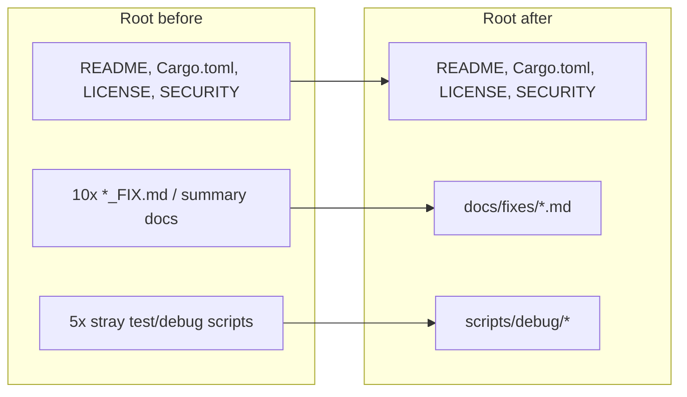

## Summary

Tidied the repository root so it is self-describing again. Ten historical
"fix note" / summary Markdown files and five stray one-off test/debug scripts
were cluttering the top level and burying the genuine entry points
(`README.md`, `Cargo.toml`, `LICENSE`, `SECURITY.md`). They are now relocated
under the directories the project structure already implies, and every
reference to them was updated. Closes #78.

- Fix-note / summary docs → `docs/fixes/`:
  `CARGO_AUDIT_FIX.md`, `CLIPPY_FIXES.md`, `CONFIDENCE_THRESHOLD_FIX.md`,
  `CORS_PROXY_ISSUE_FIX.md`, `DEPRECATED_ACTIONS_FIX.md`, `fix_summary.md`,
  `AUTO_FORMAT_WORKFLOW.md`, `CI_CD_SETUP.md`,
  `ANNUALIZED_PERFORMANCE_CALCULATION.md`, `TEST_CASES_SUMMARY.md`.
- Stray test/debug scripts → `scripts/debug/`:
  `test_feb15.rs`, `test_formula_verification.js`, `test_page_load.ts`,
  `debug_schw_current_price.ts`, `check_syntax.ts`.

All moves use `git mv` so history is preserved. The scripts went to
`scripts/debug/` rather than `tests/` deliberately: they are not real tests
(no `#[test]` / `Deno.test`), and `deno.json` plus `cargo` already glob
`tests/**/*` for lint/fmt/test — dropping them into `tests/` would have made
the quality gate try to lint and run throwaway scratch scripts.

### References updated

- `README.md` — both `CI_CD_SETUP.md` links now point at `docs/fixes/CI_CD_SETUP.md`.
- `SECURITY.md` — example `deno cache` command path updated.
- `run_annualized_tests.sh` — `node` invocation path updated.
- `src/utils.rs` — two spec-reference comments updated to the new doc path.
- `tests/annualized_performance_test.ts` — spec-reference comment updated.
- `docs/fixes/TEST_CASES_SUMMARY.md` — self-references to the verification
  script updated.

### Deno regression avoided

This is a Deno repo. Moved scripts were placed under `scripts/debug/` (outside
the `tests/**/*` globs) rather than introducing any Node tooling, and no
`package.json`/`node_modules` was added.

## Evidence

Backend/housekeeping change with no web interface to screenshot. Verified via
the new filesystem-state test and the full `./quality.sh` gate (Rust fmt,
clippy, tests, coverage, build; Deno fmt, lint, check, tests).

## Test Plan

- Added `tests/repo_root_layout_test.ts` (real filesystem-state assertions via
  `Deno.stat`):
  - fix-note docs are removed from the repository root
  - fix-note docs live under `docs/fixes/`
  - stray test/debug scripts are removed from the repository root
  - stray test/debug scripts live under `scripts/debug/`
- These tests fail against the pre-move tree and pass after the move.
- Full `./quality.sh` run (Rust + Deno) passes cleanly.
