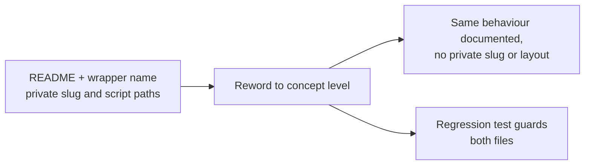

## Summary

Reworded the external daily **scorer** job references down to concept level so
this public repository no longer names the **private** upstream repository slug
or its internal script paths. A public reader cannot open either, and the
mentions leaked the private repository's internal layout. Closes #781.

Four mentions were reworded (the private tokens are deliberately not repeated
here, so this summary does not reintroduce what it removes):

| Where | Now reads |
| --- | --- |
| `README.md` prose (daily benchmark refresh) | "an external daily **scorer** job (run from the upstream prediction platform) checks out this repo and commits new `docs/scores/...` and `docs/USDAUD.json`" |
| `README.md` mermaid participant | `participant Scorer as External daily scorer job` |
| `README.md` mermaid check-in step | `Scorer->>Repo: commit "Add scores for YYYY-MM-DD"` |
| `scripts/refresh_market_indices.ts` header comment | `// The external "scorer" job, run from the upstream prediction platform, checks out this repo …` |

The third row was the same class of leak (a private internal script name) inside
the very sequence diagram being fixed, so it was reworded in the same pass rather
than left behind.

Deliberately **kept** (not private): this repo's own public slug
`stSoftwareAU/GRQ-validation`, the public product/acronym name, and the whole
described behaviour — an upstream job checks out this repo, refreshes the
benchmark indices via `deno task refresh-indices`, and commits scores + USDAUD +
indices together.

## Evidence

Documentation/comment-only change with no web interface to screenshot. Verified
by the new regression test plus a repository grep for the private slug,
`GRQ/<path>` citations, and the internal script names across both audited files
→ **no matches**. `./quality.sh` passes cleanly (cargo fmt/clippy/check/test plus
`deno test`, `deno lint`, `deno check`).

## Test Plan

- Added `tests/private_repo_scorer_reference_test.ts`:
  - `public docs and the refresh wrapper name no private scorer repo or script`
    — scans `README.md` and `scripts/refresh_market_indices.ts` for the private
    upstream slug (while allowing the public `-validation` siblings), path
    citations into the private tree, and the internal scorer/check-in script
    names, failing with `file:line` detail. This test reproduced the issue: it
    listed all five offending lines before the rewording and passes after it.
  - `the external scorer job is still documented at concept level` — asserts the
    rewording did not silently delete the explanation (the scorer job, its
    checkout-and-commit behaviour, and the diagram participant all survive).
- Full `./quality.sh` run passes, so no existing test regressed.
