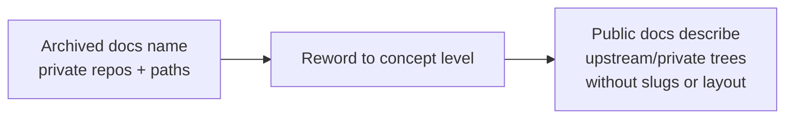

## Summary

Reworded every reference to a **private** `stSoftwareAU` sibling repository out of
the archived documentation, taking each mention down to concept level. A public
repository should not name private repositories, their slugs, or their internal
file layout — even in archived material it is dead weight to the public and maps
the private projects' structure. Closes #784.

Three private repos were confirmed private and are now absent from
`docs/archive/`:

- **the upstream prediction/scorer platform** — previously named by the slug
  `stSoftwareAU/GRQ`, the bare token `GRQ`, and `GRQ/src/…` source paths.
- **the private market-data tree** — previously `GRQ-shareprices2026Q2` (and the
  prior-quarter `GRQ-shareprices2025Q1`).
- **the private dividend-history tree** — previously `GRQ-dividends`.

### Reword convention applied

| Was | Now |
| --- | --- |
| `stSoftwareAU/GRQ`, bare `GRQ` (upstream repo) | "the upstream prediction/training repository", "upstream" |
| `GRQ/src/LearnUtil.ts:217` and other `GRQ/src/…` paths | concept phrases — "the upstream training code", "the upstream training-label producer" |
| `../GRQ-shareprices2026Q2` (prose) | "the private market-data tree" |
| `../GRQ-dividends` (prose) | "the private dividend-history tree" |
| path literals in shell/Mermaid | placeholders `../private-market-data-tree`, `../private-dividend-tree` |

Deliberately **kept** (not private): the public product/acronym name
"GRQ Validation" / "GRQ (short for _Get Rich Quick_)", this repo's own slug
`stSoftwareAU/GRQ-validation` and its paths (`src/utils.rs`, `docs/projection.js`,
`scripts/…`, `tests/…`), the out-of-scope `stSoftwareAU/GRQ-FX-validation`, and
generic algorithm identifiers that are not file paths (`volumeRecommend`,
`BUDGET_DOLLARS`, `Math.min`, `profitRecommend`, `globalThis.GRQVolume`).

### Files reworded (20)

- `docs/archive/investigations/`: `issue-552`, `issue-553`, `issue-554`,
  `issue-555`, `issue-556`, `issue-579`.
- `docs/archive/pr-summaries/`: `pr-summary-182`, `-183`, `-238`, `-265`,
  `-553`, `-575`, `-577`, `-578`, `-579`, `-600`, `-619`, `-627`, `-711`,
  `-761`.

Mermaid diagrams were kept valid — a subgraph id literally named `GRQ` was
renamed to `UP` (with its label reworded to "Training — upstream") in
`issue-554` and `issue-555`, and private path literals inside node labels were
replaced with plain placeholder text (no angle brackets, no path separators that
would break the label).

## Evidence

Backend/CLI-free, documentation-only change — there is no web interface to
screenshot. Verification was performed by repository-wide grep confirming that no
private token survives in `docs/archive/`:

- `grep -rnE 'GRQ/src|GRQ-shareprices|GRQ-dividends' docs/archive/` → **no
  matches**.
- `grep -rnE 'stSoftwareAU/GRQ([^-]|$)' docs/archive/` → **no matches** (the
  private slug is gone; `stSoftwareAU/GRQ-validation` correctly remains).
- The only remaining bare `GRQ` tokens are the public acronym/product mentions
  in `pr-summary-761.md` (the doc whose subject is defining that acronym) and
  this-repo identifiers (`GRQ-validation`, `GRQVolume`).

## Test Plan

No automated test framework covers prose content, so no unit tests were added or
changed; the change is textual and verified by the grep audit above. The Mermaid
blocks were spot-checked to confirm they still parse (subgraph/node ids and edge
references remain consistent, ` ` line breaks preserved). Australian English
was maintained throughout.
