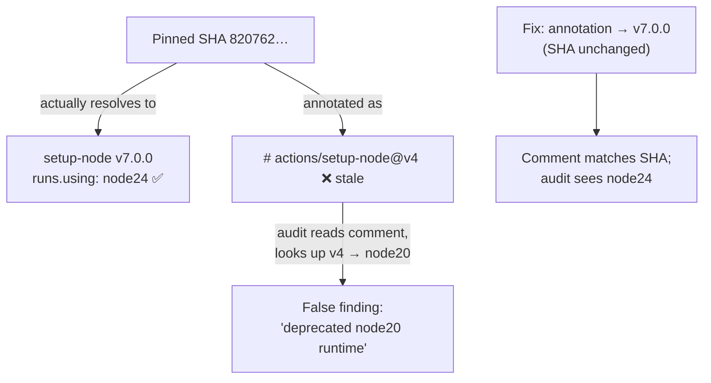

# Correct stale `actions/setup-node` version annotations (Issue #789)

## Summary

The `github-actions-audit` idle task reported that `a11y.yml` and
`markdown-lint.yml` pin `actions/setup-node` to a **v4** release, whose
**node20** Actions runtime GitHub removes on 2026-09-16. On investigation this
is a **false positive caused by a stale version-annotation comment** — the
runtime is already supported:

- Both workflows pin
  `actions/setup-node@820762786026740c76f36085b0efc47a31fe5020`.
- That SHA resolves to **`actions/setup-node` v7.0.0**, whose `action.yml`
  declares `runs.using: 'node24'` — verified against the upstream repo. It is
  **not** node20.
- The adjacent comment read `# actions/setup-node@v4`, which is simply wrong:
  it labels the pin with a release the SHA does not point at. The audit trusts
  that comment to judge the runtime, so the wrong comment produced a wrong
  finding.

The fix corrects the annotation to `# actions/setup-node@v7.0.0` in both
workflows and records that it runs on node24. The **SHA is unchanged** — it is
already the latest release (v7.0.0) on a supported runtime, so the issue's
fallback of downgrading to v6.4.0 would be a regression and is deliberately not
taken. The 40-character SHA pin is preserved throughout (supply-chain rule).

A regression guard (`assertSetupNodeRuntimeSupported`) now fails any workflow
whose `actions/setup-node` annotation records a pre-node24 major (v4 or older),
so a stale annotation cannot mislead the runtime audit again.

Fixes #789.

## Root cause

## Evidence

Backend/CI change (workflow YAML) — no web UI to screenshot.

Upstream runtime verification (`gh api`):

- `820762786026740c76f36085b0efc47a31fe5020` → tags `v7.0.0`, `v7`;
  `action.yml` `using: 'node24'`; released 2026-07-14 (> 24h quarantine).
- `action.yml` at v4.4.0 (`49933e…`) → `using: 'node20'`; at v5.0.0
  (`a0853c…`) → `using: 'node24'`, confirming the node24 era begins at v5.

The new tests fail against the stale `@v4` annotation and pass once it is
corrected (TDD red → green).

## Test Plan

- Added `assertSetupNodeRuntimeSupported` and `annotatedActionMajors` to
  `tests/workflow_assertions.ts` — parses each SHA-pinned `actions/setup-node`
  step's version-annotation comment block and asserts the recorded major is
  node24-era (v5+).
- `tests/a11y_workflow_test.ts::a11y setup-node pin is annotated with a
  node24-era release` — reproduces the finding (fails on `@v4`) and verifies the
  fix.
- `tests/markdown_lint_workflow_test.ts::Markdown Lint setup-node pin is
  annotated with a node24-era release` — same guard for markdown-lint.yml.
- Full suite: `deno test --allow-read tests/*.ts` — all workflow tests pass.
  One pre-existing, unrelated failure remains in
  `tests/market_data_presence_test.ts` (a committed market-data gate); it fails
  identically at HEAD without this change and is out of scope.
