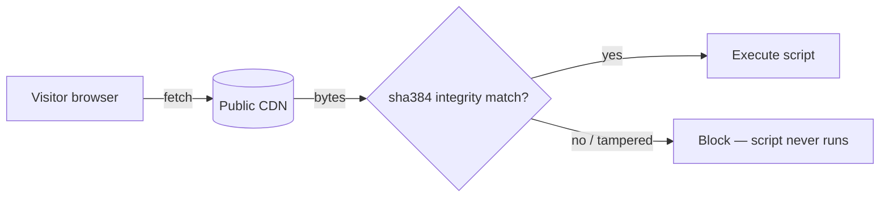

# Add Subresource Integrity to third-party CDN assets

## Summary

The published dashboard (`docs/index.html` and `docs/list.html`) loaded
executable JavaScript and CSS from public CDNs (jsDelivr, code.jquery.com,
cdn.datatables.net, cdnjs) with **no `integrity=` hash**, and two Chart.js
tags carried **no version pin** at all — so jsDelivr resolved them to the
latest release on every load. A compromised CDN, CDN account, or upstream npm
package could have served arbitrary JavaScript that ran with full privileges
in every visitor's browser, with no way for the page to reject it.

This change hardens every external `<script>`/`<link>` tag so the browser
verifies the bytes it executes:

- **Pinned the two unpinned tags** to exact versions — `chart.js@4.5.1` and
  `chartjs-plugin-annotation@3.1.0` (the versions jsDelivr was already
  resolving, so behaviour is unchanged), and pinned the date-fns adapter to
  `chartjs-adapter-date-fns@3.0.0`.
- **Added `integrity="sha384-…"` plus `crossorigin="anonymous"`** to every
  external CDN tag across both pages: Bootstrap CSS/JS, Chart.js + adapter +
  annotation plugin, jQuery 3.7.1, the DataTables/Buttons/DateTime bundle, and
  Font Awesome 6.4.0.

Every SRI hash was generated from, and verified against, the live CDN bytes
(`openssl dgst -sha384`), so browsers accept the current assets while rejecting
any altered future bytes.

Closes #79.

## Evidence

Both pages were served locally and rendered with a headless browser **after**
the SRI attributes were added. All third-party libraries loaded and executed
successfully under SRI enforcement — proving the hashes match the served bytes
(a mismatch would block the script and break the page).

Dashboard (`index.html`) — Chart.js line chart with annotation plugin and
Bootstrap styling all rendered:

Score list (`list.html`) — jQuery + DataTables (sorting, Copy/CSV/Print
buttons) and Font Awesome icons all rendered:

## Test Plan

Added `tests/cdn_sri_test.ts` (Deno), which reads the committed
`docs/index.html` and `docs/list.html` and, for every external (`http(s)`)
`<script>`/`<link>` tag, asserts that it:

1. carries a `sha384-` `integrity` hash,
2. sets `crossorigin`, and
3. is version-pinned (jsDelivr npm specs require an explicit `@version`; other
   CDNs embed the version in the path).

These tests fail against the pre-fix HTML (no integrity, unpinned Chart.js
tags) and pass after the fix. The existing Deno suite (`deno test`,
`deno fmt`, `deno lint`, `deno check`) and the Rust quality gate continue to
pass via `./quality.sh`.
