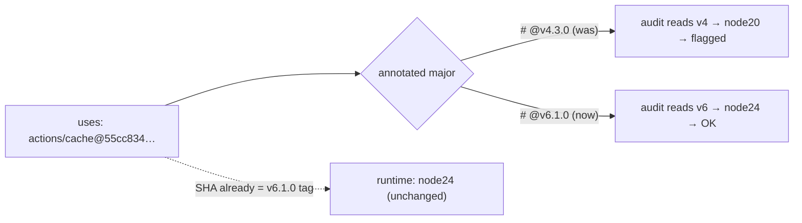

## Summary

`ci.yml` pins `actions/cache` at two call sites (job `test` L110-111, job `build`
L189-190). Both were annotated `# actions/cache@v4.3.0`, which the
`github-actions-audit` idle-task reads to judge the action's Actions runtime —
`actions/cache` v4 ships the deprecated **node20** runtime that GitHub removes on
2026-09-16.

Investigation showed the SHA pin itself was **already safe**: the pinned commit
`55cc8345863c7cc4c66a329aec7e433d2d1c52a9` is the `v6.1.0` tag, whose `action.yml`
declares `using: 'node24'`. The defect was purely the **mislabelled version
comment** — it recorded `v4.3.0` (whose real SHA is `0057852…`, node20) against a
SHA that actually points at `v6.1.0`. A drifted annotation misleads the runtime
audit (see `annotatedActionMajors`, Issue #789).

Fix: correct both trailing comments to `# actions/cache@v6.1.0` so the annotation
matches the SHA it records. The 40-character SHA pin is unchanged, so CI runtime
behaviour is identical — `v6.1.0` is the newest `actions/cache` release (published
2026-06-26, well past the 24h quarantine) and runs on node24.

This mirrors the sibling `actions/setup-node` runtime guard (Issue #789): a new
`assertCacheRuntimeSupported` helper reuses the existing `annotatedActionMajors`
parser to require every `actions/cache` pin be annotated with a node24-era major
(v5+), preventing any future regression to a node20-runtime pin.

Closes #790.

## Evidence

Backend/CLI + CI-config change — no web interface to screenshot. Verified via the
Deno test suite.

- `action.yml` at the pinned SHA `55cc834…` declares `using: 'node24'` (verified
  against `repos/actions/cache/contents/action.yml?ref=<sha>`); the mislabelled
  `v4.3.0` tag's real SHA `0057852…` declares `using: 'node20'`.
- New test failed against the mislabelled comment
  (`found v4, which maps to the removed node20 runtime`) and passes after the
  comment fix.

## Test Plan

- Added `tests/workflow_assertions.ts::assertCacheRuntimeSupported` — asserts every
  SHA-pinned `actions/cache` step carries a `# actions/cache@vX.Y.Z` annotation with
  a node24-era major (v5+).
- Added `tests/ci_workflow_test.ts::"CI workflow pins actions/cache to a node24-runtime release"`
  — reproduces #790 (failed with `found v4` before the fix, passes after).
- Full Deno suite green: `deno test --allow-read tests/*.ts` → 1356 passed, 0 failed.
- `deno fmt` / `deno lint` / `deno check` clean on both changed files; bash syntax
  check passes.
