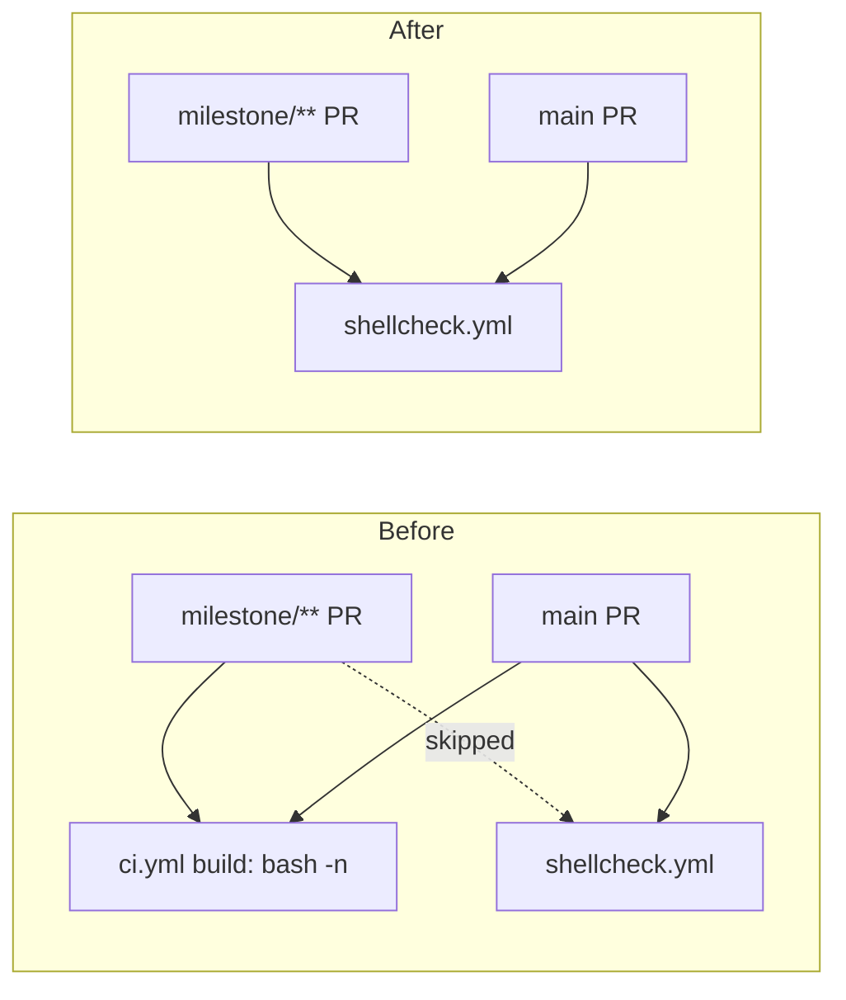

# Remove duplicate shell-syntax gate from ci.yml (Issue #791)

## Summary

The same logical check — "every `*.sh` in the repo parses" — ran in two
workflow files:

- `.github/workflows/ci.yml` (job `build`, step *Check Bash Script Syntax*):
  `find . -name "*.sh" -type f -exec bash -n {} \;`
- `.github/workflows/shellcheck.yml` (job `shellcheck`): `ludeeus/action-shellcheck`
  with `scandir: .`, `severity: warning`.

ShellCheck must parse each script before linting it and reports parse/syntax
errors at error level (included at `severity: warning`), so over the identical
scope the `bash -n` pass added no signal ShellCheck did not already provide. It
also gave one policy two homes.

**This PR removes the redundant `bash -n` step from `ci.yml`'s `build` job** and
keeps `shellcheck.yml` as the single shell-syntax gate.

**Ordering prerequisite.** The issue's ordering note warned that `shellcheck.yml`
skipped PRs targeting `milestone/*` branches (the `["*"]` glob does not match a
`/`), while `ci.yml`'s `build` job runs on `[main, "milestone/**"]`. Removing
`bash -n` without addressing this would leave milestone PRs with no shell-syntax
gate. So this PR also lists `milestone/**` in `shellcheck.yml`'s `pull_request`
and `push` triggers, so milestone PRs keep a shell-syntax gate throughout. The
broader nine-workflow milestone-filter fix remains tracked by
`stSoftwareAU/GRQ-validation#788`; this PR only touches `shellcheck.yml`, the
prerequisite for #791.

Closes #791.

## Evidence

Backend/CI-only change — no web interface to screenshot. Verified via the Deno
workflow unit tests below.

Coverage before vs after this change:



Test run:

```
deno test --allow-read tests/ci_workflow_test.ts tests/shellcheck_workflow_test.ts
ok | 26 passed | 0 failed
```

## Test Plan

- **`tests/ci_workflow_test.ts`**
  - Added `CI workflow no longer runs a redundant bash -n shell-syntax step` —
    asserts the `build` job has no *Check Bash Script Syntax* step and no step
    running `bash -n` (guards against it reappearing under another name).
  - Updated the existing `multi-line bash run blocks begin with set -euo pipefail`
    test: removed the `["build", "Check Bash Script Syntax"]` target, since that
    step no longer exists. **Business-logic change** — the step it asserted on
    was deliberately deleted; the remaining targets (`Check for changes`,
    `Generate CycloneDX SBOM`) still enforce the fail-fast convention.
- **`tests/shellcheck_workflow_test.ts`**
  - Added `ShellCheck workflow triggers on pull_request to milestone branches`.
  - Added `ShellCheck workflow triggers on push to milestone branches`.

All 26 tests pass; `deno fmt --check`, `deno lint`, and `deno check` are clean on
the modified test files.
