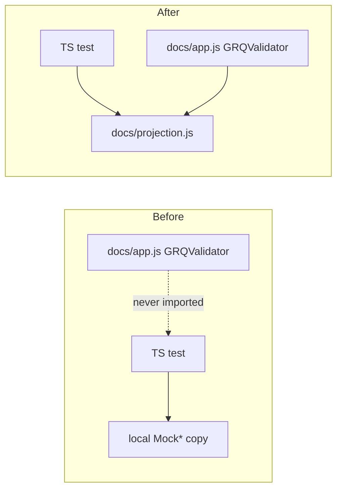

## Summary

The TypeScript suite reimplemented the dashboard's projection/scoring algorithms
as test-local `Mock*` classes and asserted on the copy — tautologies that stayed
green even if the production `GRQValidator` in `docs/app.js` drifted or broke. One
test in `tests/trend_line_extension_test.ts` even **overrode**
`calculateHybridProjectionData` inline and then asserted on the output of that very
function; `tests/integration_test.ts` recomputed formulas inline and asserted on its
own arithmetic (`20.0 ≈ 20.0`, `22.0`).

This change applies resolution **(a)** from the issue (extract the maths into a
module both `docs/app.js` and the tests import) for the core projection/scoring
kernels, and resolution **(b)** (delete the named tautologies) for the inline
method-override and inline-arithmetic steps:

- **New shared module `docs/projection.js`** — a classic-script module published on
  `globalThis` (mirroring `docs/escape.js`), with no module syntax, importable by
  both the browser dashboard and the Deno tests. It exports `setDateToMidnight`,
  `getDaysElapsed`, `calculatePerformanceReturn`, and `buildHybridProjectionData`.
- **`GRQValidator` now delegates** `getDaysElapsed`, the performance-return maths in
  `calculateStockPerformance`, and the hybrid trend-shape generation in
  `calculateHybridProjectionData` to the shared module, so production and tests
  exercise one implementation (no parallel copy to drift).
- **`docs/index.html`** loads `projection.js` before `app.js`, next to `escape.js`.
- **Tests rewritten to drive the real code** — the projection-data tests and the
  integration performance step now import `docs/projection.js` and assert on the
  shipped functions' observable output. A bug in the production trend-shape
  generation now fails these tests.

The remaining mock-validator test files (`realistic_projection_test.ts`,
`chart_data_test.ts`, `basic_score_table_test.ts`, `buy_price_logic_test.ts`,
`current_price_consistency_test.ts`, `hybrid_projection_tests.ts`,
`judgement_hybrid_test.ts`, `portfolio_view_consistency_test.ts`,
`schw_projection_test.ts`) depend on still-stateful logic (`getBuyPrice`,
`calculateTrendLine`, `calculateHybridProjection`, the dilution variants) whose
extraction touches DOM/market-data code paths that cannot be exercised headlessly.
Converting them is larger and riskier than this scope, so it is tracked as
follow-up issue **stSoftwareAU/GRQ-validation#100**.

Closes #80.

## Evidence

This is a test-architecture / CLI change with no visual UI change, so no screenshot
applies. The fix is verified by the rewritten tests, which now exercise the real
shipped code path instead of a local mock:

The shared module is the single source of truth: `GRQValidator` and the tests both
call into `docs/projection.js`, so a regression in the production maths now breaks
the suite.

## Test Plan

- **`tests/projection_module_test.ts`** (new) — 12 behavioural tests importing the
  real `docs/projection.js`: `getDaysElapsed`, `calculatePerformanceReturn`
  (happy/loss/invalid-buy-price), `setDateToMidnight` (no input mutation), and
  `buildHybridProjectionData` for the `target_based`, `dampened_trend` (incl. no
  trend line) and `realistic_trajectory` methods plus the -100% floor.
- **`tests/trend_line_extension_test.ts`** — projection-data tests now call the real
  `buildHybridProjectionData`; the inline `calculateHybridProjectionData` override
  and the `Mock*` reimplementations were removed. The `calculateTrendLine`
  regression test is retained (that function is extracted in #100).
- **`tests/integration_test.ts`** — the performance step now calls the real
  `calculatePerformanceReturn`; the `20.0 ≈ 20.0` tautology was removed.
- Full Deno suite: `deno test --allow-read tests/*.ts` → **144 passed, 0 failed**.
- `deno fmt`, `deno lint`, `deno check` all clean; `cargo check --all-targets` clean
  (no Rust files changed).
