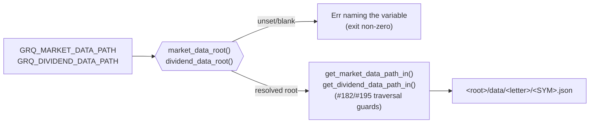

# Make market-data and dividend-data roots caller-supplied

## Summary

`src/utils.rs` hard-coded two private `stSoftwareAU` checkout paths
(`MARKET_DATA_BASE_PATH`, `DIVIDEND_DATA_BASE_PATH`). Both constants are
deleted; the data roots are now **caller-supplied** through
`GRQ_MARKET_DATA_PATH` / `GRQ_DIVIDEND_DATA_PATH`, and an unset or blank root is
a **fail-loud** error that names only the environment variable and the expected
`data/<letter>/<SYM>.json` tree — never a repository, never a `../…` sibling
default. Closes #802.

What changed:

- **Resolvers** — `pub fn market_data_root()` / `pub fn dividend_data_root()`
  read the variables (read-only `std::env::var`) and delegate to the injectable
  core `data_root_from_value()`.
- **Path-injectable cores** — `get_market_data_path_in(root, ticker)` and
  `get_dividend_data_path_in(root, ticker)`, mirroring the existing
  `market_data_repository_available_at` / `ensure_market_data_repository_at`
  idiom. The #182/#195 path-traversal guards moved in **unchanged**.
- **Public wrappers** resolve, then delegate. `market_data_repository_available()`
  deliberately stays `bool` — its doc comment now states that an unresolvable
  root reads as "absent" and that `ensure_market_data_repository()` is the
  fail-loud gate every batch entry point actually calls.
- **`create_market_data_long_csv`** resolves the root up front, so an unset root
  fails before anything is written instead of emitting a header-only CSV; its
  two "is … available and up to date?" messages interpolate the resolved root.
- **Reworded** every doc string that named a private repository.

### Deviation from the issue text (deliberate)

The issue suggested a "scoped env-var clear" for the fail-loud unit tests. The
unit tests run in parallel and roughly twenty of them read these variables
transitively (`read_market_data`, `calculate_portfolio_performance`, …), so
`set_var`/`remove_var` would race with those readers. Instead the fail-loud
contract is asserted against the injectable core `data_root_from_value(…, None)`
— deterministic, no process-state mutation — and a separate read-only test
(`test_data_roots_resolve_from_environment`) pins the wiring: the public
resolvers must agree with the ambient environment and must **not** fall back to
a default when the variable is absent.

## Evidence

Backend/CLI change — no web interface to screenshot.



**Acceptance criteria, verified locally:**

1. No private-repo literal under `src/` — a `grep -rn` over `src/` for the two
   private data-tree checkout slugs returned no matches. (That check is now the
   standing repo-wide guard `tests/private_data_root_reference_test.ts`, which
   holds the patterns so this prose no longer has to.)

2. `./quality.sh < /dev/null` → exit 0 (includes
   `cargo clippy --all-targets --all-features -- -D warnings`,
   `cargo test --all-targets --all-features`, tarpaulin, Deno lint/check/tests).
   All 113 Rust tests pass with the roots unset **and** with
   `GRQ_MARKET_DATA_PATH` set to a real tree.

3. Fail-loud with the variable unset — no header-only CSVs written:

   ```console
   $ env -u GRQ_MARKET_DATA_PATH ./target/release/grq-validation --docs-path docs
   Error: GRQ_MARKET_DATA_PATH is not set — set it to the directory holding the market-data `data/<letter>/<SYM>.json` tree
   $ echo $?
   1
   $ git status --short docs   # nothing modified
   ```

4. Byte-identical output with the variable set. A copy of `docs/` (index trimmed
   to `2025-03-05`) was processed by the pre-change binary (`git stash`) and by
   the new binary with `GRQ_MARKET_DATA_PATH` pointed at the private
   market-data tree:

   ```console
   $ diff -r /tmp/802-base/docs /tmp/802-new/docs
   (no differences — market-data CSV, dividends CSV and index.json all identical)
   $ md5 …/2025/March/5.csv
   both: c7ee8749c6b398f28b88cbb6166f5663   (2357 rows)
   ```

## Test Plan

Added (`src/utils.rs`, `#[cfg(test)]`):

- `test_market_data_root_unset_fails_loud` — unset **and** blank roots error;
  the message names `GRQ_MARKET_DATA_PATH` and the expected tree, and must not
  contain `GRQ-` (tripwire against a reintroduced repository name).
- `test_dividend_data_root_unset_fails_loud` — same for
  `GRQ_DIVIDEND_DATA_PATH`.
- `test_data_root_from_value_returns_caller_supplied_path` — happy path.
- `test_data_roots_resolve_from_environment` — read-only wiring check; catches a
  silent default being reintroduced.

Modified:

- `test_ensure_market_data_repository_err_when_absent` — asserts the base path
  passed in plus `/data`, that the message names `GRQ_MARKET_DATA_PATH`, and
  that it names no repository (replaces the old assertion that the message
  contained the private market-data checkout slug).
- The #182/#195 traversal-guard tests and the path-shape tests now run against a
  `tempfile::tempdir()` root via the `_in` cores.
- Three skip guards now gate on `market_data_root()` instead of the constant.

Deleted:

- `test_market_data_base_path_points_to_current_quarter` — it existed only to
  assert the private path (issue #183); with an operator-supplied root there is
  no quarter to pin.

Integration tests (minimal mechanical swap; making them hermetic is tracked
separately): `tests/dividend_tests.rs`, `tests/market_data_tests.rs`,
`tests/create_market_data_csv_test.rs` and
`tests/create_market_data_long_csv_test.rs` resolve via
`market_data_root()` / `dividend_data_root()` and skip when unset, preserving
their existing skip semantics.

Documentation: README _Environment Variables_ now documents both roots, the
fail-loud contract and the resolution flow (Mermaid).
