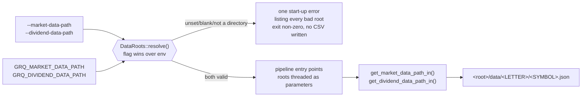

# PR Summary — Issue #803

## Summary

Wires the caller-supplied data roots through the binary and both shell entry
points, so an operator (public or private) can point the pipeline at their own
data tree and `std::env::var` is read in exactly one place. Closes #803.

- **CLI flags** — `--market-data-path` and `--dividend-data-path`
  (`src/main.rs`), each overriding `GRQ_MARKET_DATA_PATH` /
  `GRQ_DIVIDEND_DATA_PATH`. No `default_value`: an absent root is an error, not
  a silent `../…` guess. The fallback is resolved by hand, so no new `clap`
  feature was needed.
- **Explicit threading** — `main` resolves both roots once into a new
  `DataRoots { market, dividends }` (`src/data_roots.rs`) and passes them to
  `ensure_market_data_repository_at`, `create_market_data_long_csv_for_score_file`,
  `create_dividend_csv_for_score_file`, `calculate_portfolio_performance`,
  `calculate_hybrid_projection` and `update_index_with_performance`. The
  internal chain (`read_market_data`, `read_dividend_data`,
  `calculate_dividends_for_period`, and the CSV writers) now takes the root as a
  parameter instead of resolving it per call.
- **Start-up validation** — both roots are validated (set, non-blank, an
  existing directory) before any work begins, and a single error lists *every*
  unusable root with the flag/variable and expected layout.
- **Dead wrappers removed** — `ensure_market_data_repository()`,
  `market_data_repository_available()` and `get_dividend_data_path()` became
  dead once the roots are threaded, and are deleted;
  `ensure_market_data_repository_at()` is now the public gate.
- **Shell wiring** — `run.sh` and `process_date.sh` source a shared
  `scripts/require_data_roots.sh` (with a fail-loud check that the helper
  exists) and refuse to build or write anything when either variable is unset,
  then pass both roots through as flags. Existing `set`/exit-code handling is
  untouched.
- **Documentation** — `README.md` and `CONTRIBUTING.md` document the two flags
  and variables, the precedence rule, the
  `<root>/data/<UPPERCASE-FIRST-LETTER>/<SYMBOL>.json` layout, worked
  `MarketData` / `DividendData` JSON examples, and state explicitly that this
  repository ships no such data and names no upstream source.

## Evidence

This is a backend/CLI change with no web interface, so there is no screenshot.
Evidence is the real binary's behaviour plus the test suite.

### Resolution flow



### `--help` documents both flags and their variables

```text
      --market-data-path <MARKET_DATA_PATH>
          Directory holding the market-data `data/<LETTER>/<SYMBOL>.json` tree; overrides GRQ_MARKET_DATA_PATH
      --dividend-data-path <DIVIDEND_DATA_PATH>
          Directory holding the dividend-history `data/<LETTER>/<SYMBOL>.json` tree; overrides GRQ_DIVIDEND_DATA_PATH
```

### Missing roots fail at start-up, before any work

```text
$ env -u GRQ_MARKET_DATA_PATH -u GRQ_DIVIDEND_DATA_PATH \
    ./target/release/grq-validation --docs-path "$WORK/docs"; echo "exit=$?"
Error: cannot start: caller-supplied data root(s) unusable:
  - GRQ_MARKET_DATA_PATH is not set — set it to the directory holding the market-data `data/<letter>/<SYM>.json` tree
  - GRQ_DIVIDEND_DATA_PATH is not set — set it to the directory holding the dividend-data `data/<letter>/<SYM>.json` tree
Pass --market-data-path/--dividend-data-path, or set GRQ_MARKET_DATA_PATH/GRQ_DIVIDEND_DATA_PATH. This
repository ships no market or dividend data: point each root at your own directory holding a
`data/<UPPERCASE-FIRST-LETTER>/<SYMBOL>.json` tree.
exit=1
```

Both shell entry points do the same before building anything:

```text
$ env -u GRQ_MARKET_DATA_PATH -u GRQ_DIVIDEND_DATA_PATH ./process_date.sh 2025-06-05
ERROR: unset data root(s): GRQ_MARKET_DATA_PATH, GRQ_DIVIDEND_DATA_PATH
Set each variable (or pass the matching --market-data-path /
--dividend-data-path flag) to a directory holding a
data/<UPPERCASE-FIRST-LETTER>/<SYMBOL>.json tree, for example:
  export GRQ_MARKET_DATA_PATH=/path/to/market-data
  export GRQ_DIVIDEND_DATA_PATH=/path/to/dividend-history
```

### A caller-supplied tree reproduces a full run

Against a synthetic root (one symbol, one dividend, `docs/` fixture), the run
produced the expected CSVs and folded the dividend into the return
(+10% price, +1.25% dividend = 11.25%), proving the dividend root is threaded
all the way into `calculate_portfolio_performance`:

```text
$ GRQ_MARKET_DATA_PATH=$WORK/market GRQ_DIVIDEND_DATA_PATH=$WORK/dividends \
    ./target/release/grq-validation --docs-path "$WORK/docs" --process-all
… Performance for 2025-06-20: 11.25% (90-day), 54.13% (annualized), 1 included stocks

$ cat $WORK/docs/scores/2025/June/20.csv
date,ticker,high,low,open,close,split_coefficient,volume
2025-06-20,NYSE:TEST,101,99,100,100,1.0,1000
2025-09-18,NYSE:TEST,111,109,110,110,1.0,1200

$ cat $WORK/docs/scores/2025/June/20-dividends.csv
date,symbol,amount
2025-07-15,NYSE:TEST,1.25
```

A byte-compare against today's published output for a real date needs the
operator's own data tree, which this environment does not have; the CSV writers
themselves are unchanged apart from taking the root as a parameter.

### Single environment read site

```text
$ grep -rn 'env::var' src/
src/utils.rs:48:    std::env::var(variable).ok()
```

### Quality gates

`./quality.sh < /dev/null` passes cleanly: `cargo fmt --check`,
`cargo clippy --all-targets --all-features -- -D warnings`, `cargo test`
(129 tests), the release build, `bash -n` over every script, and the Deno
format/lint/check/test suite. `shellcheck --severity=warning run.sh
process_date.sh scripts/require_data_roots.sh` is clean.

## Test Plan

### Added

- `src/data_roots.rs` unit tests — `resolve_accepts_existing_directories_from_flags`,
  `resolve_lists_every_unusable_root_in_one_error`,
  `resolve_reports_only_the_broken_root`,
  `resolve_rejects_a_blank_flag_rather_than_falling_back`. Hermetic: they drive
  resolution through flags only, so they never mutate or depend on the ambient
  environment.
- `tests/cli_flag_cleanup_test.rs` —
  `help_documents_both_data_root_flags_and_their_env_vars`,
  `missing_data_roots_fails_at_startup_listing_both`,
  `missing_data_roots_writes_no_partial_csv`,
  `market_data_path_flag_overrides_env` (environment names a usable root, the
  flag names a broken one, and the flag's path is what fails — proving
  precedence), and `environment_supplies_the_roots_when_no_flag_is_given`.
- `tests/main_error_propagation_test.rs` —
  `missing_data_roots_fail_before_date_processing`, asserting the start-up error
  exits non-zero and never reaches the per-date "reading TSV file" path.
- `tests/shell_data_root_preflight_test.rs` — runs the real `run.sh` and
  `process_date.sh` with both variables removed from the child environment and
  asserts a non-zero exit, both variable names and the layout in the message,
  and (for `process_date.sh`) that the guard fires before the build.

### Modified (documented business-logic change)

Threading the roots changes the signatures of the pipeline entry points, so the
existing callers in tests were updated to pass a root — no test was removed or
weakened:

- `tests/cli_flag_cleanup_test.rs`, `tests/main_error_propagation_test.rs` — the
  binary helpers now pass `--market-data-path`/`--dividend-data-path` at
  temporary directories and clear both variables from the child environment, so
  they still exercise their original flag and error-propagation assertions under
  the new start-up contract.
- `tests/create_market_data_csv_test.rs`,
  `tests/create_market_data_long_csv_test.rs`, `tests/market_data_tests.rs`,
  `tests/dividend_tests.rs` — pass the already-resolved root they were skipping
  on.
- `tests/update_index_with_performance_test.rs` — passes an absent dividend root
  (its synthetic ticker has no dividend history), keeping the expected figures
  price-driven.
- `src/utils.rs` unit tests — traversal-guard and projection tests pass an
  explicit absent root; the environment wiring test now goes through the single
  `env_root` read site.
