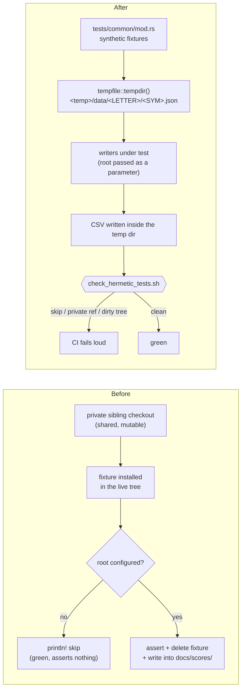

# PR Summary — Issue #804

## Summary

Makes the four Rust market-data/dividend integration tests hermetic: each now
builds a **synthetic** fixture tree inside its own `tempfile::tempdir()` root
instead of reading — or, in two cases, installing fixtures into — the operator's
private data checkout. The skip guards are gone, so the tests genuinely run and
assert on CI, and `cargo test` no longer rewrites a committed file.
Closes #804.

- **Shared fixture builders** (`tests/common/mod.rs`) — `write_market_data`,
  `write_dividend_data`, and `write_score_file`, all hand-written synthetic
  data. Fixture paths are built through the crate's own
  `get_market_data_path_in` / `get_dividend_data_path_in` cores (#802), so a
  fixture always lands exactly where the code under test looks for it.
- **No skips** — the `market_data_root_configured` guards, the
  presence guard in `tests/market_data_tests.rs`, and the "external data
  repository not available" messages are deleted. With a temp root the data is
  always available.
- **No shared-tree mutation** — the RAII `MarketDataFixture` guards (which
  created and deleted directories inside the operator's live tree) and their
  `first_missing_ancestor` cleanup helper are deleted.
- **Clean working tree** — `tests/dividend_tests.rs` writes beside a synthetic
  score file in its temp dir, so it no longer overwrites the committed
  `docs/scores/2025/March/5-dividends.csv`.
- **Stronger assertions** — `tests/market_data_tests.rs` previously skipped
  everywhere; it now asserts ticker extraction order, per-ticker path resolution
  under the supplied root (including the `NYSE:X.A` → `X-A` mapping), the
  derived output path, and the exact row set.
  `tests/dividend_tests.rs` additionally pins the 180-day window filter and that
  a symbol with no dividend file is skipped rather than fatal.
- **Automated gate** — `scripts/check_hermetic_tests.sh`, run by `quality.sh`
  and by the CI Rust job, runs the four tests with **both root variables unset**
  and fails loud on a skip line, a private data-tree reference under `tests/`,
  a binary that ran zero tests, or a working tree dirtied by the run.

## Evidence

No web interface is involved — this is a test-hermeticity and CI change, so
there is no screenshot. The evidence is the test run itself, executed with no
data root configured and no sibling data directory present.

```text
$ env -u GRQ_MARKET_DATA_PATH -u GRQ_DIVIDEND_DATA_PATH \
      cargo test --all-targets --all-features
...
running 2 tests (create_market_data_csv_test) ...... ok
running 4 tests (create_market_data_long_csv_test) . ok
running 1 test  (dividend_tests) .................... ok
running 1 test  (market_data_tests) ................. ok
test result: ok. 95 passed; 0 failed; 0 ignored   (lib)
exit=0

$ grep -nE '^Skipping |external data repository not available' <test output>
(no matches)

$ git status --porcelain
(empty)

$ grep -rnE "$PRIVATE_TREE_PATTERN" tests/   # slugs + deleted base-path constants
(no matches)

$ ./scripts/check_hermetic_tests.sh
✅ Hermetic integration tests verified.
```

Where the data comes from before and after — what is asserted is unchanged; only
the source of the fixtures moved:



## Test Plan

Rewritten (same assertions, hermetic fixtures):

- `tests/create_market_data_csv_test.rs` — `date,symbol,close` header and the
  inclusive 180-day window, direct writer and score-file wrapper.
- `tests/create_market_data_long_csv_test.rs` — the 8-column header, per-column
  field mapping, the "no rows written → error" guard, and the #687
  preserve/replace atomic-write behaviour.
- `tests/market_data_tests.rs` — ticker extraction, per-ticker path resolution
  under the supplied root, derived output path, and the exact row set.
- `tests/dividend_tests.rs` — `date,symbol,amount` header, dividend presence,
  row count, window filter, and missing-symbol tolerance; output lands in the
  temp dir.

Added:

- `tests/common/mod.rs` — shared synthetic fixture builders.
- `tests/hermetic_test_gate_test.ts` — asserts the gate script exists, is
  executable, rejects every private data-tree marker, compares
  `git status --porcelain` around the run, and is wired into the `ci.yml` test
  job exactly once.
- `scripts/check_hermetic_tests.sh` — the gate itself.

Full `./quality.sh` passes (fmt, clippy `-D warnings`, check, `cargo test`, the
new hermetic gate, tarpaulin, release build, and the 1416-test Deno suite).
