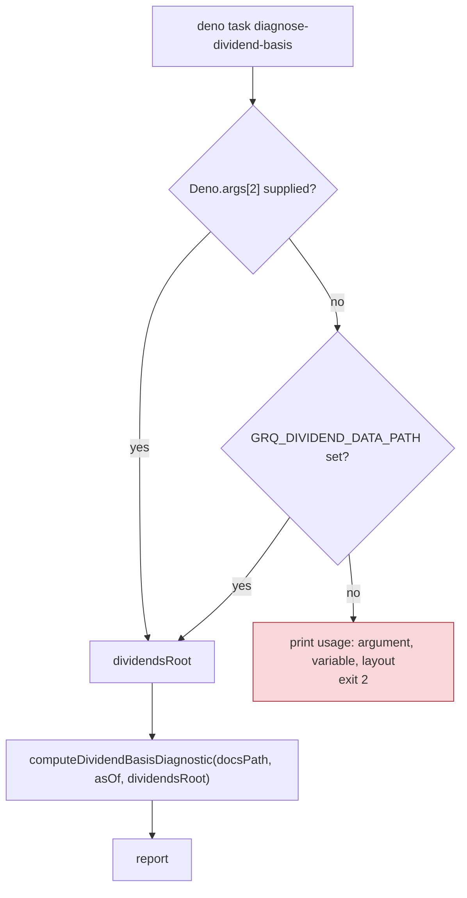

# Require an explicit dividend-history root in the dividend-basis diagnostics (Issue #805)

## Summary

Two diagnostic scripts defaulted their dividend-history root to a private
sibling checkout, so running them with no argument reached for a repository most
callers cannot see — and, when it was absent, silently reported a zero flat
credit for every ticker instead of failing. The root is now **caller-supplied
with no default**, matching the rule the Rust side already follows for its data
roots (#802, #803). Closes #805.

- `scripts/dividend_basis_diagnostic.ts` — `dividendsRoot` is now a **required**
  parameter of `computeDividendBasisDiagnostic` (same position, so callers only
  need to pass the argument). Omitting it is a compile error under `deno check`.
- New exported contract in the same module: `DIVIDEND_DATA_PATH_ENV`,
  `DIVIDENDS_ROOT_USAGE` and `requireDividendsRoot(argRoot, envRoot)` — explicit
  argument wins, then the environment variable, blank values count as absent,
  and neither throws with the usage text rather than falling back to a relative
  sibling path.
- `scripts/diagnose_dividend_basis.ts` — resolves the root from
  `Deno.args[2] ?? GRQ_DIVIDEND_DATA_PATH`, and on neither prints the usage text
  (positional argument, environment variable, expected
  `<root>/data/<UPPERCASE-FIRST-LETTER>/<SYMBOL>.json` layout and the
  `{ exDivDate, amount }` record shape) and exits **2**.
- Reading the variable needs `--allow-env`: added to the run comment and to the
  `diagnose-dividend-basis` task in `deno.json`, and to the Deno test line in
  `quality.sh` (CI's `deno-quality.yml` already ran with `--allow-env`).
- Comment blocks in `dividend_basis_diagnostic.ts` and `diagnostic_types.ts`
  reworded to concept level ("the private dividend-history tree"), matching the
  vocabulary of #784; the `src/utils.rs DIVIDEND_DATA_BASE_PATH`
  cross-reference is dropped — that constant was deleted by #802.
- `scripts/check_hermetic_tests.sh` spells its private-tree grep as an
  alternation (`GRQ-(shareprices|dividends)`) so `scripts/` no longer contains a
  private checkout name anywhere, without weakening the gate.



## Evidence

Backend/CLI change — no web interface to screenshot. Verified by running the
task three ways and by report parity against the pre-change code.

**No root supplied → fails loud, exit 2** (previously: reached for the private
sibling path):

```text
$ env -u GRQ_DIVIDEND_DATA_PATH deno task diagnose-dividend-basis
Task diagnose-dividend-basis deno run --allow-read --allow-env scripts/diagnose_dividend_basis.ts
ERROR: no dividend-history root supplied.

Usage: deno run --allow-read --allow-env scripts/diagnose_dividend_basis.ts \
         [docsPath] [asOf YYYY-MM-DD] <dividendsRoot>

Supply the root as the third positional argument (dividendsRoot) or set
GRQ_DIVIDEND_DATA_PATH. There is no default: the dividend-history tree is
private, so it is never assumed to sit beside this checkout.

Expected layout: <root>/data/<UPPERCASE-FIRST-LETTER>/<SYMBOL>.json, each
file holding { "data": [ { "ex_dividend_date": "...", "amount": ... }, ... ] }
records, read as the { exDivDate, amount } shape the shipped kernels consume.
exit=2
```

**Report parity** — the pre-change scripts (restored from `HEAD`) and the new
ones, run over the same fixture root and as-of date, produce byte-identical
reports:

```text
$ deno run --allow-read scripts/_baseline_cli.ts \
    tests/fixtures/dividend_basis/docs 2026-06-01 \
    tests/fixtures/dividend_basis/dividend-history > /tmp/before.txt
$ deno run --allow-read --allow-env scripts/diagnose_dividend_basis.ts \
    tests/fixtures/dividend_basis/docs 2026-06-01 \
    tests/fixtures/dividend_basis/dividend-history > /tmp/after.txt
$ diff /tmp/before.txt /tmp/after.txt && echo "IDENTICAL REPORTS"
IDENTICAL REPORTS
```

**Root supplied via `GRQ_DIVIDEND_DATA_PATH`** (same output via the positional
argument):

```text
As-of date:              2026-06-01
Dividend history root:   tests/fixtures/dividend_basis/dividend-history
Matured score dates:     1
Included stock-rows:     2
Mean (raw):              +0.125 pp
Mean flat credit yield:  0.250 %
Mean windowed yield:     0.125 %
Rows with 0 in-window:   50.0 %
```

**Acceptance grep**:

```text
$ rg -n 'GRQ-shareprices|GRQ-dividends' scripts/
NO MATCHES in scripts/
```

**Tripwire proven to trip** — re-adding the old default to
`scripts/diagnose_dividend_basis.ts` fails the guard immediately:

```text
diagnostic scripts name no private data-tree checkout (issue #805) ... FAILED
error: AssertionError: Values are not equal: Private data-tree references found:
```

## Test Plan

Added to `tests/dividend_basis_diagnostic_test.ts` (behavioural, real functions):

- `requireDividendsRoot prefers the explicit argument over the environment`
- `requireDividendsRoot falls back to the environment variable` — including a
  whitespace-only argument
- `requireDividendsRoot fails loud when no root is supplied` — throws with the
  usage text; no silent fallback
- `the missing-root usage text names the argument, the variable and the layout`
- `computeDividendBasisDiagnostic reads an explicitly supplied root` —
  end-to-end over the new committed fixture root; asserts the computed report
  (2 rows, mean +0.125 pp, 50% zero-windowed) is still correct
- `computeDividendBasisDiagnostic yields a zero flat credit for an unknown root`
  — pins the degraded-but-quiet behaviour that made the old default dangerous

Added to `tests/private_repo_reference_scripts_test.ts`:

- `diagnostic scripts name no private data-tree checkout (issue #805)` — the
  regression tripwire over `scripts/**/*.ts` for the private *data-path* class
  (the existing `tests/diagnostic_private_path_test.ts` still guards the #783
  source-citation class; both stay green).

New fixture `tests/fixtures/dividend_basis/` (documented in
`tests/fixtures/README.md`): a score index with one matured and one immature
date plus a `data/<LETTER>/<SYMBOL>.json` history tree, so the end-to-end test
needs neither the private tree nor write permission.

**Modified existing test (documented as required):**
`tests/hermetic_test_gate_test.ts::hermetic-test gate rejects every private
data-tree marker` asserted that `check_hermetic_tests.sh` *contained* each
marker literally, which the alternation above breaks. It now extracts the
gate's declared `PRIVATE_TREE_PATTERN` and asserts the pattern **matches** every
marker — a behavioural check that is independent of how the pattern is spelled
and that still fails if a marker is dropped from the gate (verified with a
pattern missing the dividend marker → `false`). No test was removed or
weakened.

Gates: `deno check`, `deno lint`, `deno fmt --check`, `markdownlint-cli2` and
`./quality.sh` (whose Deno test line now carries `--allow-env`) all pass.
