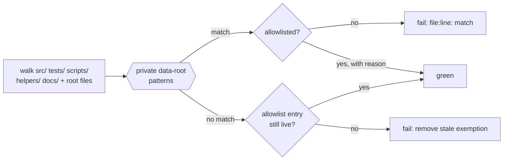

## Summary

Added `tests/private_data_root_reference_test.ts`, a repo-wide guard that fails
if any file names a **private** sibling data checkout, and cleared the prose
stragglers the guard found. Nothing previously stopped a private data-root
literal from being reintroduced: the sibling fixes each shipped a guard over one
directory, leaving `src/`, `tests/`, `helpers/`, the shell scripts and the
archived documentation uncovered — which is exactly where the literals lived.
Closes #806.

The guard walks `src/`, `tests/`, `scripts/`, `helpers/`, `docs/` and the
root-level `*.sh`/`*.json`/`*.md` files (skipping `.git/`, `target/`,
`node_modules/`, `.coverage/` and non-text file types) and reports
`file:line: match` for every hit of:

- the private market-data slug — matched by **prefix**, so a bumped quarter
  suffix is still caught (#183 shows the suffix moves);
- the private dividend-history slug;
- any `../GRQ-…` relative sibling checkout, other than this repo's own public
  `GRQ-validation` / `GRQ-FX-validation`.

### Stragglers cleared

| File | Was | Now |
| --- | --- | --- |
| `scripts/diagnostic_types.ts:44` | named the dividend-history checkout | "the private dividend-history tree" |
| `pr-summary-784.md` (5 lines) | before/after table + verification grep spelled both slugs | concept-level wording; the grep is described, not spelled |
| `pr-summary-802.md` (3 lines) | acceptance grep, an env-var example, a deleted assertion | concept-level wording |
| `pr-summary-804.md:61` | verification grep spelled both slugs | refers to the gate's `$PRIVATE_TREE_PATTERN` |

Option 3a (reword) was taken throughout, consistent with what #784 did to the
rest of the archive — no archive file is allowlisted.

### Visible allowlist, not silent holes

Three files legitimately hold a literal. Each is an entry in `ALLOWLIST` with
the reason inline, and a dedicated case asserts every entry **still matches
something**, so a stale exemption turns the suite red instead of quietly
widening the hole.

- `scripts/check_hermetic_tests.sh` — #804's gate greps `tests/` for these
  names, so its `PRIVATE_TREE_PATTERN` *is* the literal. That gate now skips the
  new guard's own file (which likewise spells the patterns); it still covers the
  rest of `tests/`, and the repo-wide guard covers `tests/` too, so no coverage
  is lost.
- `scripts/diagnose_dividend_basis.ts` and `scripts/dividend_basis_diagnostic.ts`
  — **temporary**, pending #805, which makes the dividend-history root
  caller-supplied and rewords those comments. Both entries are commented as
  such, and the liveness case fails the moment #805 lands with the entries still
  present, forcing their removal in that PR.



## Evidence

Backend/CLI-only change — no web interface to screenshot. Verification is the
test suite plus the demonstrations below.

**1. The guard is green on this branch (all sibling fixes landed):**

```console
$ deno test --allow-read tests/private_data_root_reference_test.ts
no file names a private data-root checkout ... ok (532ms)
every allowlist entry is still live ... ok (1ms)
positive control: the matcher finds a planted literal ... ok (261µs)
positive control: the walk reaches the tree it claims to scan ... ok (11ms)
positive control: scanning without exemptions finds the guard's own patterns ... ok (470ms)
ok | 5 passed | 0 failed (1s)
```

**2. It fails when a sibling fix is reverted.** A private constant was appended
to `src/utils.rs` to simulate reverting #802 — note the quarter suffix is
`2026Q3`, not the one the constant originally used, proving the prefix match
survives a quarter bump:

```console
no file names a private data-root checkout ... FAILED (404ms)
  src/utils.rs:3713: ../GRQ-…2026Q3
  src/utils.rs:3713: GRQ-…2026Q3
FAILED | 4 passed | 1 failed
```

**3. The positive controls fail if the walk is stubbed to return nothing**
(`return paths.sort()` → `return []`):

```console
positive control: the matcher finds a planted literal ... ok
positive control: the walk reaches the tree it claims to scan ... FAILED
positive control: scanning without exemptions finds the guard's own patterns ... FAILED
FAILED | 3 passed | 2 failed
```

**4. The allowlist cannot go stale.** Neutralising the literal in
`scripts/check_hermetic_tests.sh`:

```console
every allowlist entry is still live ... FAILED
  AssertionError: scripts/check_hermetic_tests.sh no longer contains a private
  data-root literal — remove its allowlist entry from
  tests/private_data_root_reference_test.ts
```

**5. Acceptance one-liner.** `rg -n '<the two slugs>' -- . ':!.git' ':!target'`
now returns only the guard test's own pattern definitions and fixture
expectations, the allowlisted `scripts/check_hermetic_tests.sh:26`, and the two
`scripts/` files #805 owns — no archive file, no `src/`, no `helpers/`.

**6. Full gate.** `./quality.sh < /dev/null` → **exit 0** (cargo fmt/clippy/
check/test/tarpaulin/release build, `check_hermetic_tests.sh`,
`deno test --allow-read tests/*.ts` → 1421 passed, `deno fmt`, `deno lint`,
`deno check`). `markdownlint-cli2 "**/*.md"` → 0 errors.

### Note on #805

Issue #805 has not landed, so `scripts/diagnose_dividend_basis.ts` and
`scripts/dividend_basis_diagnostic.ts` still default their dividend-history root
to a private sibling path. Making that root caller-supplied is #805's functional
change and explicitly out of scope here, so those two files carry a commented,
self-retiring allowlist entry rather than being fixed in this PR. Parent #780
should be re-verified once #805 lands and those entries are removed.

## Test Plan

New — `tests/private_data_root_reference_test.ts` (5 cases):

- `no file names a private data-root checkout` — the guard itself; lists
  `file:line: match` for every offender.
- `every allowlist entry is still live` — each exemption must still match
  something, so entries cannot go stale (demonstration 4).
- `positive control: the matcher finds a planted literal` — a fixture string
  assembled at runtime, asserted down to the exact `file:line: match` strings.
- `positive control: the walk reaches the tree it claims to scan` — non-empty,
  and reaches known files in each scan root (demonstration 3).
- `positive control: scanning without exemptions finds the guard's own patterns`
  — end-to-end proof that walk + read + match all work together.

Modified:

- `scripts/check_hermetic_tests.sh` — the #804 grep now excludes the new guard's
  own file (which necessarily spells the patterns). No test change; the gate is
  still run by `quality.sh` and passes.

No existing test was removed, disabled or weakened.
