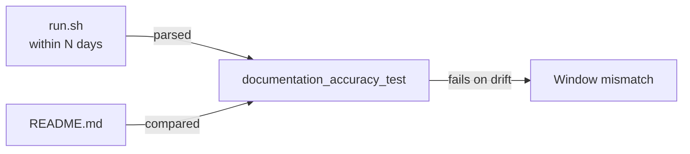

# Remove source-text grep assertions on documentation prose

## Summary

Replaced the grep-as-assertion anti-pattern in two test files that asserted on
the *prose* of Markdown documentation rather than on any behaviour or derivable
invariant. Rewording the docs broke these tests even when nothing regressed,
and the docs could drift factually wrong as long as the magic substrings
survived. Closes #81.

Changes:

- **`tests/documentation_accuracy_test.ts`**
  - **Rewrote** the recent-files-window test as a WHAT-test: it now parses the
    window (in days) from `run.sh` — the canonical source — and asserts the
    README documents the *same* value. Editing the window in both files keeps
    the test green; a drift between `run.sh` and the README fails it. This
    replaces the hardcoded `within 100 days` / `within 180 days` substring
    magic values copied from the implementation.
  - **Deleted** the brittle prose-grep cases that verified nothing about
    behaviour: the Australian-English spelling police (`behavior`,
    `organization`, `color-coded`), the `helpers/`/`scripts/` directory and
    literal CLI-flag string checks, and the `# Test comment` ban.
  - **Kept** the genuine derivable-relationship checks: README references every
    workflow that exists (compared against `Deno.readDir(.github/workflows)`),
    README does not reference removed workflows, the licence-placeholder check,
    and the workflow-listing helper sanity test.
- **`tests/security_md_test.ts`**
  - **Kept** the behavioural check that `SECURITY.md` exists at the repository
    root (a `Deno.stat` file check).
  - **Deleted** the substring greps over the runbook prose (disclosure email,
    `deno.json`/`deno.lock`/`deno test`, `cargo update -p`/`cargo audit`/
    `cargo test`). Runbook contents are better policed by the Markdown linter
    and human review than by string asserts in the unit-test runner.

These deletions are the explicit requirement of the issue, not an incidental
change: documentation accuracy is served by the Markdown linter and review
checklist, while the unit-test runner now only asserts derivable invariants.

## Evidence

Backend/test-only change — no web interface to screenshot. Verified by running
the affected suites and the full quality gate.

The recent-files-window test before and after:

- **Before:** `assert(text.includes("within 100 days"))` — a hand-copied magic
  value; rewording the README breaks it, and a stale README passes as long as
  the literal string survives.
- **After:** parse `within (\d+) days` from `run.sh`, assert the README
  documents that same number — a derivable relationship between two files.

`./quality.sh` passes cleanly: `179 passed | 0 failed` for the Deno suite,
plus `cargo fmt`/`clippy`/`test`, `deno fmt`/`lint`/`check`.

## Test Plan

- Modified `tests/documentation_accuracy_test.ts`:
  - `README.md documents the recent-files window used by run.sh` — new
    parse-from-`run.sh` invariant (replaces the hardcoded substring test).
  - Retained: workflow-existence, removed-workflow, licence-placeholder, and
    workflow-listing-helper tests.
  - Removed: helpers/scripts directory, CLI-flag strings, `# Test comment`,
    and Australian-English spelling grep tests.
- Modified `tests/security_md_test.ts`:
  - Retained: `SECURITY.md exists at the repository root`.
  - Removed: disclosure-contact and Deno/Rust emergency-bump substring greps.
- Ran `deno test --allow-read tests/documentation_accuracy_test.ts tests/security_md_test.ts`
  → `6 passed | 0 failed`.
- Ran `./quality.sh < /dev/null` → all checks pass.
